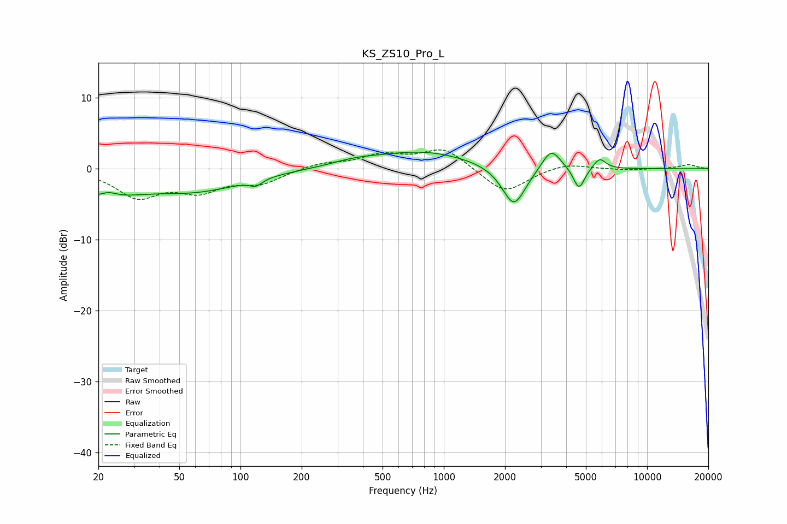

# KS_ZS10_Pro_L
See [usage instructions](https://github.com/jaakkopasanen/AutoEq#usage) for more options and info.

### Parametric EQs
Apply preamp of -2.4 dB when using parametric equalizer.

|   # | Type    |   Fc (Hz) |    Q |   Gain (dB) |
|-----|---------|-----------|------|-------------|
|   1 | Peaking |        20 | 0.77 |        -3.4 |
|   2 | Peaking |        22 | 3.35 |         0.9 |
|   3 | Peaking |        62 | 0.59 |        -2.8 |
|   4 | Peaking |       119 | 4.68 |        -0.9 |
|   5 | Peaking |       365 | 1.26 |         0.6 |
|   6 | Peaking |       788 | 0.59 |         2.4 |
|   7 | Peaking |      2213 | 2.43 |        -5.8 |
|   8 | Peaking |      3375 | 3.11 |         3.1 |
|   9 | Peaking |      4625 | 5.07 |        -3.1 |
|  10 | Peaking |      5841 | 4.7  |         1.5 |

### Fixed Band EQs
When using fixed band (also called graphic) equalizer, apply preamp of **-2.8 dB** (if available) and set gains manually with these parameters.

|   # | Type    |   Fc (Hz) |    Q |   Gain (dB) |
|-----|---------|-----------|------|-------------|
|   1 | Peaking |        31 | 1.41 |        -3.8 |
|   2 | Peaking |        62 | 1.41 |        -2.7 |
|   3 | Peaking |       125 | 1.41 |        -1.9 |
|   4 | Peaking |       250 | 1.41 |         0.8 |
|   5 | Peaking |       500 | 1.41 |         1.8 |
|   6 | Peaking |      1000 | 1.41 |         2.9 |
|   7 | Peaking |      2000 | 1.41 |        -3.6 |
|   8 | Peaking |      4000 | 1.41 |         0.9 |
|   9 | Peaking |      8000 | 1.41 |        -0.2 |
|  10 | Peaking |     16000 | 1.41 |         0.6 |

### Graphs

