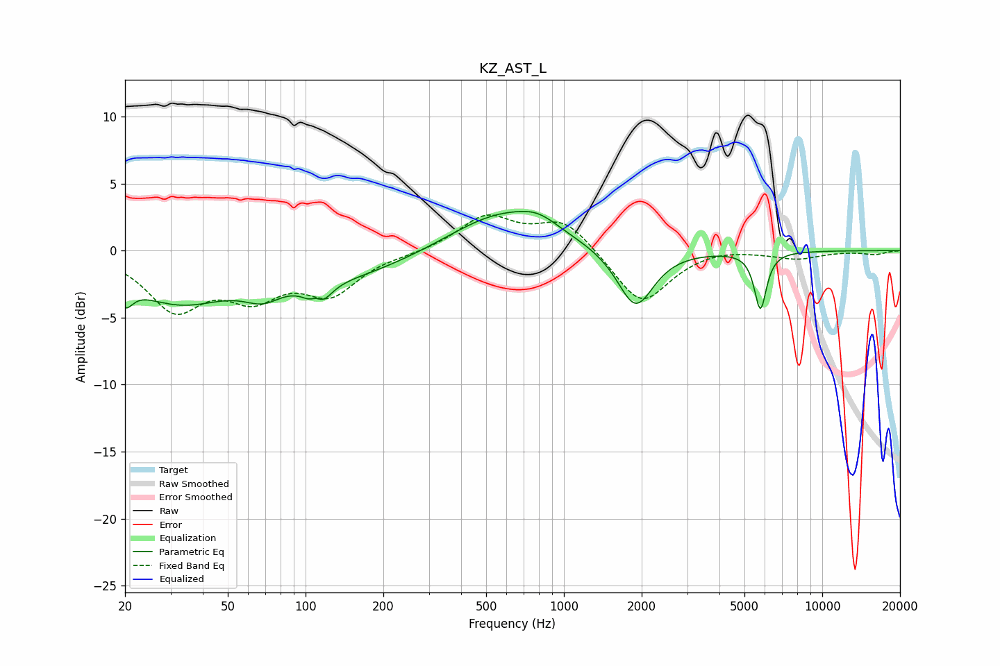

# KZ_AST_L
See [usage instructions](https://github.com/jaakkopasanen/AutoEq#usage) for more options and info.

### Parametric EQs
Apply preamp of -3.0 dB when using parametric equalizer.

|   # | Type    |   Fc (Hz) |    Q |   Gain (dB) |
|-----|---------|-----------|------|-------------|
|   1 | Peaking |        20 | 4.78 |        -1.7 |
|   2 | Peaking |        32 | 0.7  |        -3.6 |
|   3 | Peaking |        68 | 1.88 |        -1.4 |
|   4 | Peaking |       110 | 5.3  |         2.3 |
|   5 | Peaking |       111 | 3.84 |        -3.6 |
|   6 | Peaking |       149 | 0.56 |        -1.8 |
|   7 | Peaking |       569 | 0.71 |         2.9 |
|   8 | Peaking |       796 | 1.81 |         0.9 |
|   9 | Peaking |      1893 | 2.03 |        -4.5 |
|  10 | Peaking |      5763 | 6    |        -4.3 |

### Fixed Band EQs
When using fixed band (also called graphic) equalizer, apply preamp of **-2.7 dB** (if available) and set gains manually with these parameters.

|   # | Type    |   Fc (Hz) |    Q |   Gain (dB) |
|-----|---------|-----------|------|-------------|
|   1 | Peaking |        31 | 1.41 |        -4.1 |
|   2 | Peaking |        62 | 1.41 |        -2.9 |
|   3 | Peaking |       125 | 1.41 |        -2.9 |
|   4 | Peaking |       250 | 1.41 |        -0.2 |
|   5 | Peaking |       500 | 1.41 |         2.5 |
|   6 | Peaking |      1000 | 1.41 |         2.3 |
|   7 | Peaking |      2000 | 1.41 |        -4.1 |
|   8 | Peaking |      4000 | 1.41 |         0.3 |
|   9 | Peaking |      8000 | 1.41 |        -0.6 |
|  10 | Peaking |     16000 | 1.41 |        -0.3 |

### Graphs

