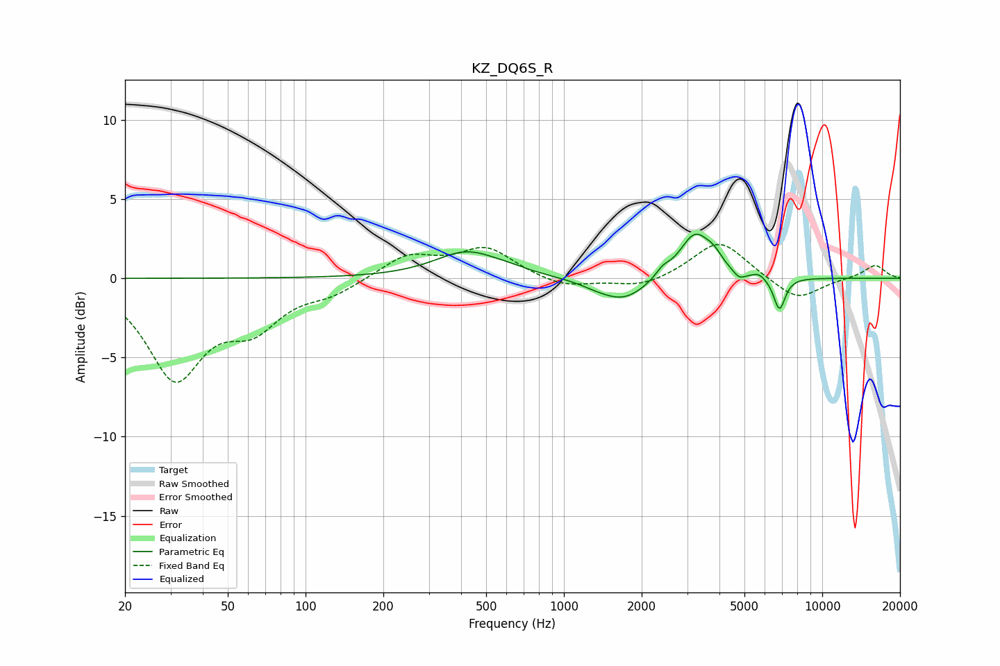

# KZ_DQ6S_R
See [usage instructions](https://github.com/jaakkopasanen/AutoEq#usage) for more options and info.

### Parametric EQs
Apply preamp of -2.9 dB when using parametric equalizer.

|   # | Type    |   Fc (Hz) |    Q |   Gain (dB) |
|-----|---------|-----------|------|-------------|
|   1 | Peaking |       422 | 1.13 |         1.7 |
|   2 | Peaking |       622 | 1.92 |         0.2 |
|   3 | Peaking |      1322 | 2.25 |        -0.2 |
|   4 | Peaking |      1701 | 1.5  |        -1.5 |
|   5 | Peaking |      2409 | 5.25 |         0.5 |
|   6 | Peaking |      3219 | 2.31 |         2.9 |
|   7 | Peaking |      3815 | 4.54 |         0.6 |
|   8 | Peaking |      4769 | 6    |        -0.5 |
|   9 | Peaking |      5690 | 6    |         0.3 |
|  10 | Peaking |      6830 | 6    |        -2.1 |

### Fixed Band EQs
When using fixed band (also called graphic) equalizer, apply preamp of **-2.2 dB** (if available) and set gains manually with these parameters.

|   # | Type    |   Fc (Hz) |    Q |   Gain (dB) |
|-----|---------|-----------|------|-------------|
|   1 | Peaking |        31 | 1.41 |        -6.1 |
|   2 | Peaking |        62 | 1.41 |        -2.6 |
|   3 | Peaking |       125 | 1.41 |        -0.8 |
|   4 | Peaking |       250 | 1.41 |         1.4 |
|   5 | Peaking |       500 | 1.41 |         1.9 |
|   6 | Peaking |      1000 | 1.41 |        -0.6 |
|   7 | Peaking |      2000 | 1.41 |        -0.6 |
|   8 | Peaking |      4000 | 1.41 |         2.4 |
|   9 | Peaking |      8000 | 1.41 |        -1.4 |
|  10 | Peaking |     16000 | 1.41 |         0.9 |

### Graphs

