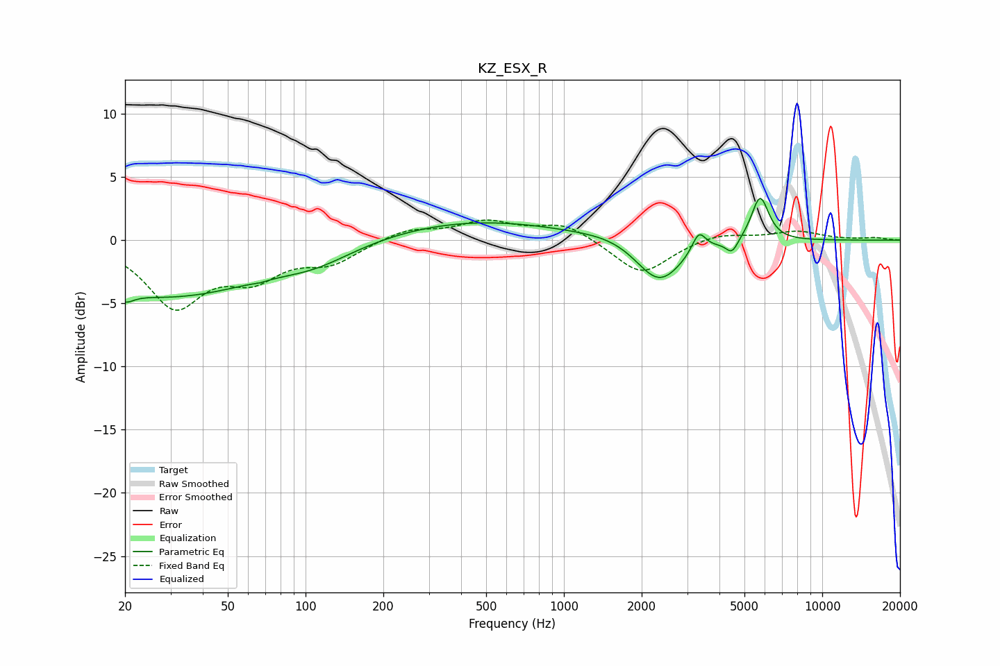

# KZ_ESX_R
See [usage instructions](https://github.com/jaakkopasanen/AutoEq#usage) for more options and info.

### Parametric EQs
Apply preamp of -3.4 dB when using parametric equalizer.

|   # | Type    |   Fc (Hz) |    Q |   Gain (dB) |
|-----|---------|-----------|------|-------------|
|   1 | Peaking |        20 | 4.33 |        -0.8 |
|   2 | Peaking |        29 | 0.37 |        -4.4 |
|   3 | Peaking |        66 | 5.72 |        -0.1 |
|   4 | Peaking |       110 | 0.95 |        -1.1 |
|   5 | Peaking |       444 | 0.4  |         1.6 |
|   6 | Peaking |      1588 | 1.22 |         0.4 |
|   7 | Peaking |      2337 | 1.56 |        -3.6 |
|   8 | Peaking |      3330 | 5.32 |         1.6 |
|   9 | Peaking |      4474 | 5.92 |        -1.1 |
|  10 | Peaking |      5747 | 4.14 |         3.6 |

### Fixed Band EQs
When using fixed band (also called graphic) equalizer, apply preamp of **-1.7 dB** (if available) and set gains manually with these parameters.

|   # | Type    |   Fc (Hz) |    Q |   Gain (dB) |
|-----|---------|-----------|------|-------------|
|   1 | Peaking |        31 | 1.41 |        -5   |
|   2 | Peaking |        62 | 1.41 |        -2.5 |
|   3 | Peaking |       125 | 1.41 |        -1.6 |
|   4 | Peaking |       250 | 1.41 |         0.9 |
|   5 | Peaking |       500 | 1.41 |         1.4 |
|   6 | Peaking |      1000 | 1.41 |         1.3 |
|   7 | Peaking |      2000 | 1.41 |        -2.8 |
|   8 | Peaking |      4000 | 1.41 |         0.6 |
|   9 | Peaking |      8000 | 1.41 |         0.7 |
|  10 | Peaking |     16000 | 1.41 |         0.2 |

### Graphs

