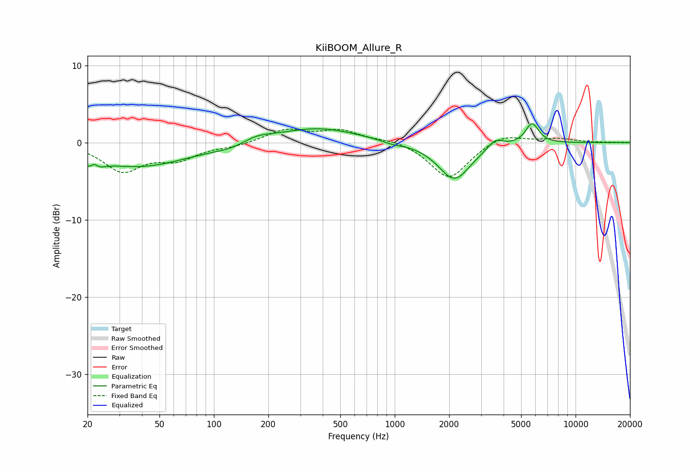

# KiiBOOM_Allure_R
See [usage instructions](https://github.com/jaakkopasanen/AutoEq#usage) for more options and info.

### Parametric EQs
Apply preamp of -2.5 dB when using parametric equalizer.

|   # | Type    |   Fc (Hz) |    Q |   Gain (dB) |
|-----|---------|-----------|------|-------------|
|   1 | Peaking |        22 | 3.87 |        -2.9 |
|   2 | Peaking |        22 | 5.82 |         2.2 |
|   3 | Peaking |        39 | 0.51 |        -3.1 |
|   4 | Peaking |       126 | 1.46 |        -0.5 |
|   5 | Peaking |       172 | 1.72 |         0.8 |
|   6 | Peaking |       372 | 0.64 |         1.9 |
|   7 | Peaking |       966 | 2.46 |        -0.3 |
|   8 | Peaking |      2139 | 1.58 |        -4.8 |
|   9 | Peaking |      3599 | 3.4  |         1.2 |
|  10 | Peaking |      5752 | 3.79 |         2.6 |

### Fixed Band EQs
When using fixed band (also called graphic) equalizer, apply preamp of **-1.8 dB** (if available) and set gains manually with these parameters.

|   # | Type    |   Fc (Hz) |    Q |   Gain (dB) |
|-----|---------|-----------|------|-------------|
|   1 | Peaking |        31 | 1.41 |        -3.5 |
|   2 | Peaking |        62 | 1.41 |        -1.9 |
|   3 | Peaking |       125 | 1.41 |        -0.4 |
|   4 | Peaking |       250 | 1.41 |         1.6 |
|   5 | Peaking |       500 | 1.41 |         1.5 |
|   6 | Peaking |      1000 | 1.41 |         0.5 |
|   7 | Peaking |      2000 | 1.41 |        -4.8 |
|   8 | Peaking |      4000 | 1.41 |         1.2 |
|   9 | Peaking |      8000 | 1.41 |         0.5 |
|  10 | Peaking |     16000 | 1.41 |         0   |

### Graphs

