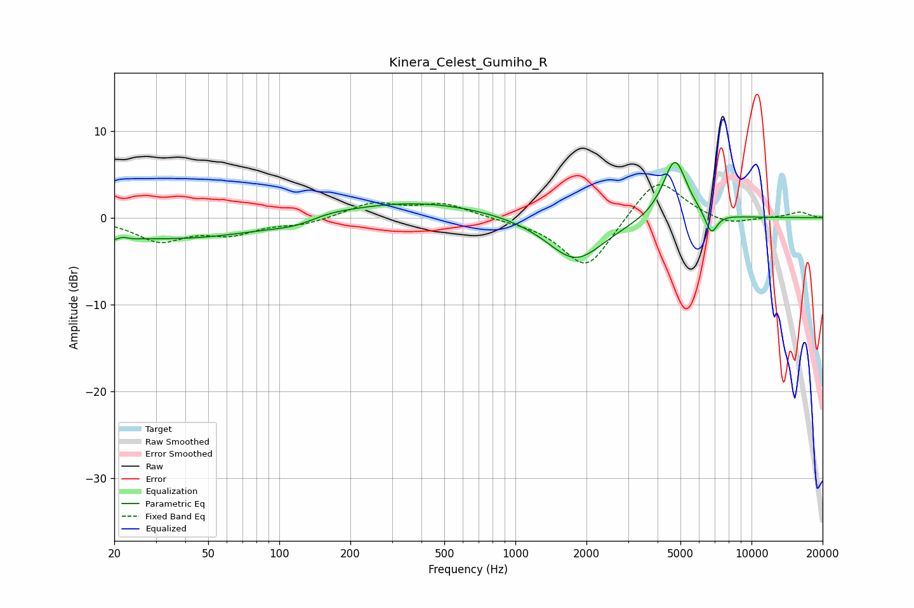

# Kinera_Celest_Gumiho_R
See [usage instructions](https://github.com/jaakkopasanen/AutoEq#usage) for more options and info.

### Parametric EQs
Apply preamp of -6.5 dB when using parametric equalizer.

|   # | Type    |   Fc (Hz) |    Q |   Gain (dB) |
|-----|---------|-----------|------|-------------|
|   1 | Peaking |        21 | 3.6  |        -2.3 |
|   2 | Peaking |        21 | 4.59 |         2   |
|   3 | Peaking |        37 | 0.38 |        -2.4 |
|   4 | Peaking |       120 | 1.34 |        -0.8 |
|   5 | Peaking |       155 | 1.43 |         0.5 |
|   6 | Peaking |       366 | 0.44 |         1.9 |
|   7 | Peaking |      1742 | 1.64 |        -0.3 |
|   8 | Peaking |      1801 | 1.14 |        -4.8 |
|   9 | Peaking |      4735 | 2.73 |         7.1 |
|  10 | Peaking |      6750 | 5.24 |        -2.6 |

### Fixed Band EQs
When using fixed band (also called graphic) equalizer, apply preamp of **-3.9 dB** (if available) and set gains manually with these parameters.

|   # | Type    |   Fc (Hz) |    Q |   Gain (dB) |
|-----|---------|-----------|------|-------------|
|   1 | Peaking |        31 | 1.41 |        -2.6 |
|   2 | Peaking |        62 | 1.41 |        -1.6 |
|   3 | Peaking |       125 | 1.41 |        -0.7 |
|   4 | Peaking |       250 | 1.41 |         1.7 |
|   5 | Peaking |       500 | 1.41 |         1.5 |
|   6 | Peaking |      1000 | 1.41 |        -0.2 |
|   7 | Peaking |      2000 | 1.41 |        -6.1 |
|   8 | Peaking |      4000 | 1.41 |         5   |
|   9 | Peaking |      8000 | 1.41 |        -0.9 |
|  10 | Peaking |     16000 | 1.41 |         0.6 |

### Graphs

