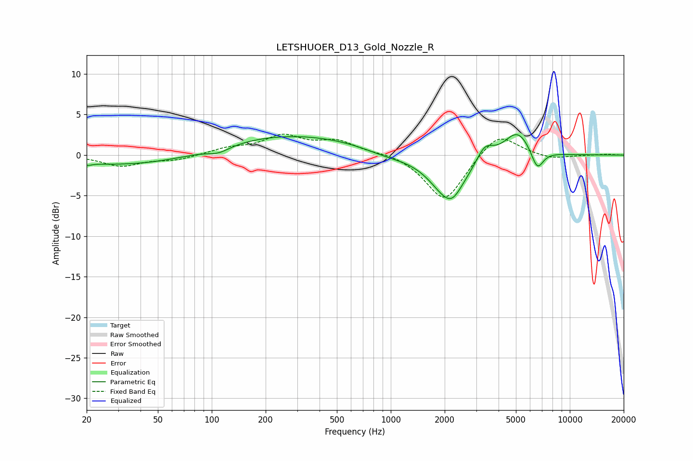

# LETSHUOER_D13_Gold_Nozzle_R
See [usage instructions](https://github.com/jaakkopasanen/AutoEq#usage) for more options and info.

### Parametric EQs
Apply preamp of -2.6 dB when using parametric equalizer.

|   # | Type    |   Fc (Hz) |    Q |   Gain (dB) |
|-----|---------|-----------|------|-------------|
|   1 | Peaking |        20 | 5.88 |        -0.3 |
|   2 | Peaking |        41 | 0.35 |        -1.5 |
|   3 | Peaking |       109 | 2.33 |        -0.7 |
|   4 | Peaking |       255 | 0.32 |         2.6 |
|   5 | Peaking |       941 | 1.1  |        -0.7 |
|   6 | Peaking |      2108 | 1.41 |        -5.4 |
|   7 | Peaking |      2215 | 3.56 |        -0.6 |
|   8 | Peaking |      3346 | 2.99 |         2   |
|   9 | Peaking |      5099 | 1.88 |         3.2 |
|  10 | Peaking |      6581 | 3.99 |        -2.6 |

### Fixed Band EQs
When using fixed band (also called graphic) equalizer, apply preamp of **-2.7 dB** (if available) and set gains manually with these parameters.

|   # | Type    |   Fc (Hz) |    Q |   Gain (dB) |
|-----|---------|-----------|------|-------------|
|   1 | Peaking |        31 | 1.41 |        -1.3 |
|   2 | Peaking |        62 | 1.41 |        -0.6 |
|   3 | Peaking |       125 | 1.41 |         0.7 |
|   4 | Peaking |       250 | 1.41 |         2.2 |
|   5 | Peaking |       500 | 1.41 |         1.6 |
|   6 | Peaking |      1000 | 1.41 |         0.4 |
|   7 | Peaking |      2000 | 1.41 |        -5.8 |
|   8 | Peaking |      4000 | 1.41 |         3   |
|   9 | Peaking |      8000 | 1.41 |        -0.5 |
|  10 | Peaking |     16000 | 1.41 |         0.1 |

### Graphs

