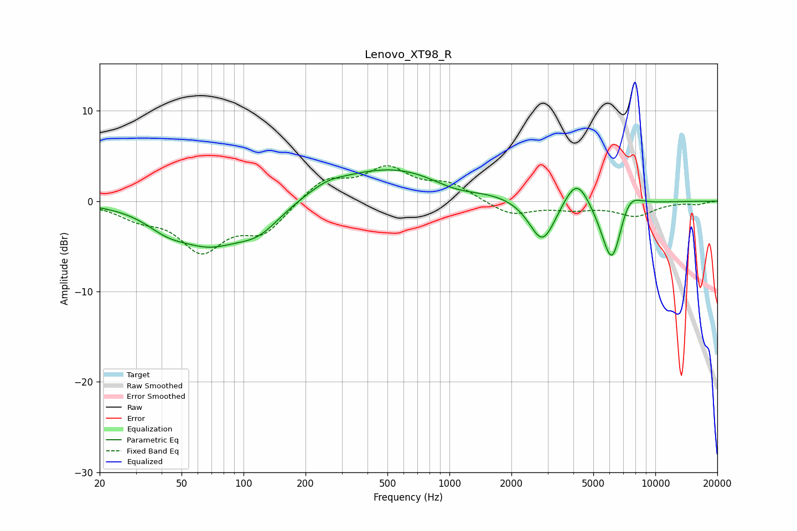

# Lenovo_XT98_R
See [usage instructions](https://github.com/jaakkopasanen/AutoEq#usage) for more options and info.

### Parametric EQs
Apply preamp of -3.6 dB when using parametric equalizer.

|   # | Type    |   Fc (Hz) |    Q |   Gain (dB) |
|-----|---------|-----------|------|-------------|
|   1 | Peaking |        42 | 1.35 |        -1.7 |
|   2 | Peaking |        68 | 0.91 |        -3.9 |
|   3 | Peaking |       119 | 1.22 |        -2.8 |
|   4 | Peaking |       255 | 1.84 |         0.6 |
|   5 | Peaking |       581 | 0.41 |         4.1 |
|   6 | Peaking |      1054 | 1.01 |        -1.6 |
|   7 | Peaking |      2829 | 2.17 |        -5.1 |
|   8 | Peaking |      4150 | 2.27 |         3.4 |
|   9 | Peaking |      6161 | 2.58 |        -7.8 |
|  10 | Peaking |      7369 | 2.36 |         2.6 |

### Fixed Band EQs
When using fixed band (also called graphic) equalizer, apply preamp of **-4.0 dB** (if available) and set gains manually with these parameters.

|   # | Type    |   Fc (Hz) |    Q |   Gain (dB) |
|-----|---------|-----------|------|-------------|
|   1 | Peaking |        31 | 1.41 |        -1.5 |
|   2 | Peaking |        62 | 1.41 |        -5.1 |
|   3 | Peaking |       125 | 1.41 |        -3.2 |
|   4 | Peaking |       250 | 1.41 |         2.5 |
|   5 | Peaking |       500 | 1.41 |         3.4 |
|   6 | Peaking |      1000 | 1.41 |         1.7 |
|   7 | Peaking |      2000 | 1.41 |        -1.6 |
|   8 | Peaking |      4000 | 1.41 |        -0.7 |
|   9 | Peaking |      8000 | 1.41 |        -1.5 |
|  10 | Peaking |     16000 | 1.41 |        -0.3 |

### Graphs

