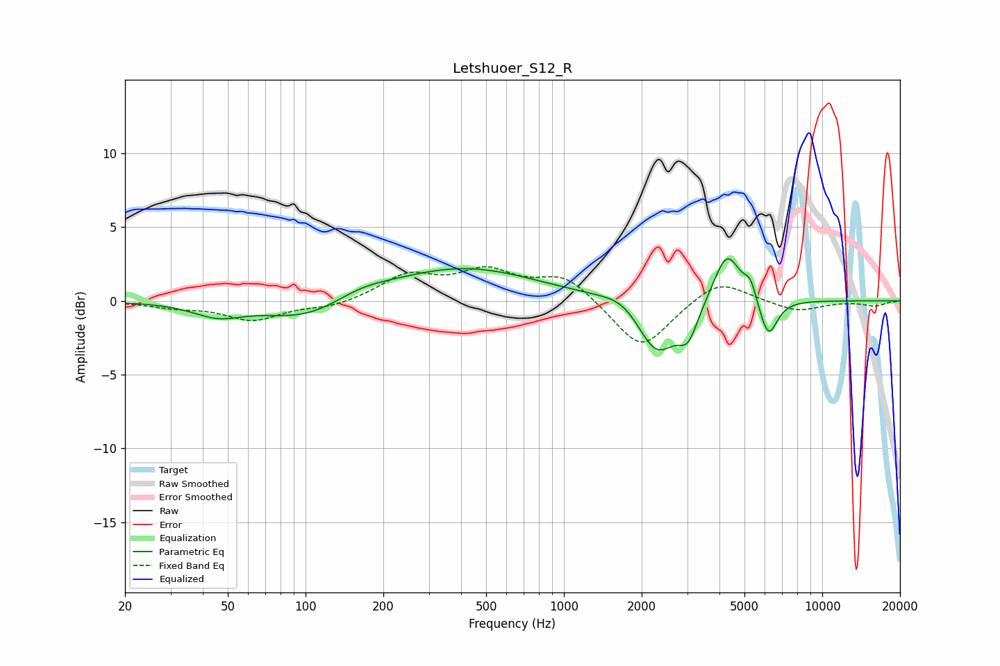

# Letshuoer_S12_R
See [usage instructions](https://github.com/jaakkopasanen/AutoEq#usage) for more options and info.

### Parametric EQs
Apply preamp of -2.9 dB when using parametric equalizer.

|   # | Type    |   Fc (Hz) |    Q |   Gain (dB) |
|-----|---------|-----------|------|-------------|
|   1 | Peaking |        46 | 1.52 |        -0.9 |
|   2 | Peaking |       102 | 0.84 |        -1.5 |
|   3 | Peaking |       163 | 1.23 |         0.7 |
|   4 | Peaking |       406 | 0.5  |         2.3 |
|   5 | Peaking |      1716 | 1.77 |         0.8 |
|   6 | Peaking |      2284 | 1.81 |        -3.8 |
|   7 | Peaking |      3026 | 3.73 |        -2   |
|   8 | Peaking |      4278 | 2.65 |         3.6 |
|   9 | Peaking |      5268 | 6    |         1.2 |
|  10 | Peaking |      6183 | 3.88 |        -2.7 |

### Fixed Band EQs
When using fixed band (also called graphic) equalizer, apply preamp of **-2.4 dB** (if available) and set gains manually with these parameters.

|   # | Type    |   Fc (Hz) |    Q |   Gain (dB) |
|-----|---------|-----------|------|-------------|
|   1 | Peaking |        31 | 1.41 |        -0.4 |
|   2 | Peaking |        62 | 1.41 |        -1.3 |
|   3 | Peaking |       125 | 1.41 |        -0.4 |
|   4 | Peaking |       250 | 1.41 |         1.7 |
|   5 | Peaking |       500 | 1.41 |         1.8 |
|   6 | Peaking |      1000 | 1.41 |         1.7 |
|   7 | Peaking |      2000 | 1.41 |        -3.4 |
|   8 | Peaking |      4000 | 1.41 |         1.6 |
|   9 | Peaking |      8000 | 1.41 |        -0.7 |
|  10 | Peaking |     16000 | 1.41 |        -0.3 |

### Graphs

