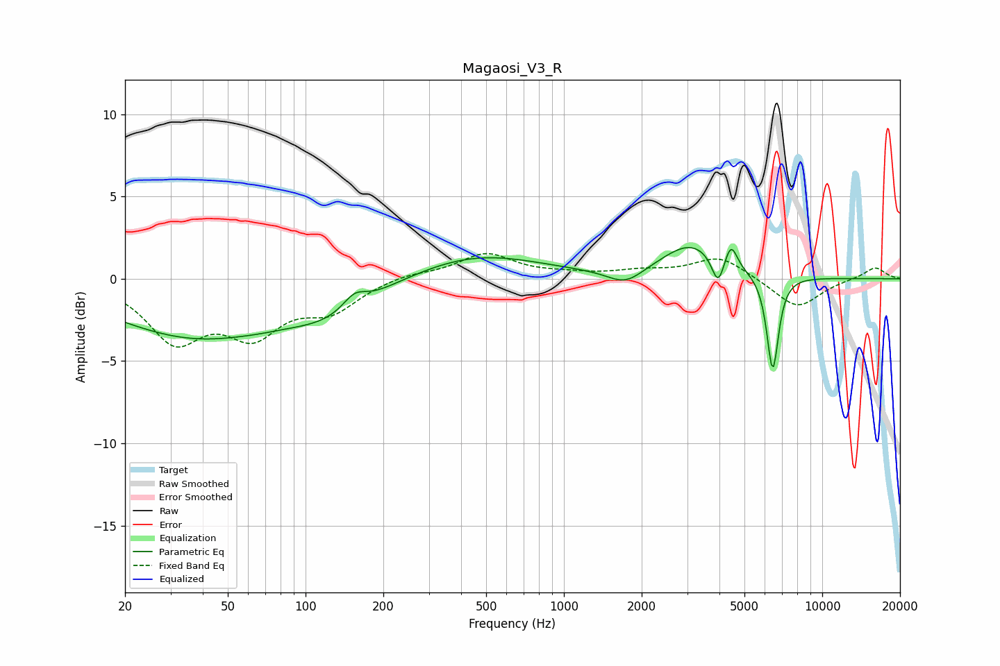

# Magaosi_V3_R
See [usage instructions](https://github.com/jaakkopasanen/AutoEq#usage) for more options and info.

### Parametric EQs
Apply preamp of -2.0 dB when using parametric equalizer.

|   # | Type    |   Fc (Hz) |    Q |   Gain (dB) |
|-----|---------|-----------|------|-------------|
|   1 | Peaking |        38 | 0.42 |        -3.5 |
|   2 | Peaking |        67 | 1.98 |        -0.1 |
|   3 | Peaking |       127 | 0.83 |        -1.5 |
|   4 | Peaking |       155 | 3.07 |         0.9 |
|   5 | Peaking |       456 | 0.56 |         1.5 |
|   6 | Peaking |      1730 | 2.03 |        -0.9 |
|   7 | Peaking |      3123 | 1.2  |         2.1 |
|   8 | Peaking |      3950 | 5.78 |        -1.8 |
|   9 | Peaking |      4432 | 6    |         1.5 |
|  10 | Peaking |      6431 | 6    |        -5.8 |

### Fixed Band EQs
When using fixed band (also called graphic) equalizer, apply preamp of **-1.6 dB** (if available) and set gains manually with these parameters.

|   # | Type    |   Fc (Hz) |    Q |   Gain (dB) |
|-----|---------|-----------|------|-------------|
|   1 | Peaking |        31 | 1.41 |        -3.5 |
|   2 | Peaking |        62 | 1.41 |        -3   |
|   3 | Peaking |       125 | 1.41 |        -1.7 |
|   4 | Peaking |       250 | 1.41 |         0.3 |
|   5 | Peaking |       500 | 1.41 |         1.5 |
|   6 | Peaking |      1000 | 1.41 |         0.2 |
|   7 | Peaking |      2000 | 1.41 |         0.4 |
|   8 | Peaking |      4000 | 1.41 |         1.4 |
|   9 | Peaking |      8000 | 1.41 |        -1.8 |
|  10 | Peaking |     16000 | 1.41 |         0.7 |

### Graphs

