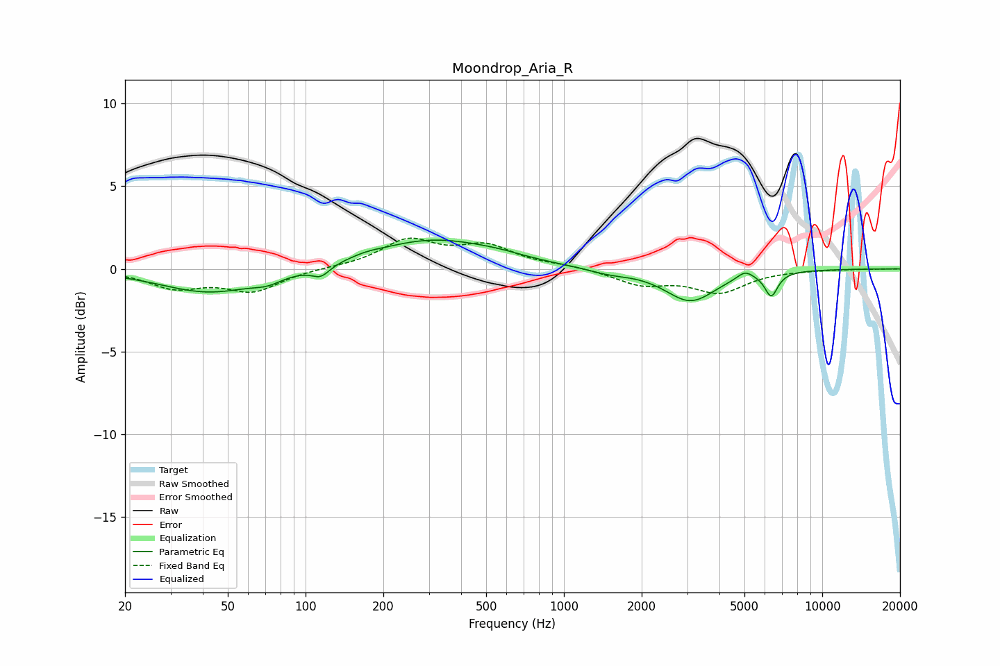

# Moondrop_Aria_R
See [usage instructions](https://github.com/jaakkopasanen/AutoEq#usage) for more options and info.

### Parametric EQs
Apply preamp of -1.8 dB when using parametric equalizer.

|   # | Type    |   Fc (Hz) |    Q |   Gain (dB) |
|-----|---------|-----------|------|-------------|
|   1 | Peaking |        43 | 0.75 |        -1.4 |
|   2 | Peaking |        71 | 2.53 |        -0.4 |
|   3 | Peaking |       114 | 4.05 |        -0.6 |
|   4 | Peaking |       171 | 2.35 |         0.2 |
|   5 | Peaking |       308 | 0.62 |         1.7 |
|   6 | Peaking |       557 | 1.28 |         0.2 |
|   7 | Peaking |      1495 | 1.74 |        -0.3 |
|   8 | Peaking |      3089 | 1.44 |        -1.9 |
|   9 | Peaking |      5020 | 4.58 |         0.5 |
|  10 | Peaking |      6349 | 5.44 |        -1.4 |

### Fixed Band EQs
When using fixed band (also called graphic) equalizer, apply preamp of **-2.0 dB** (if available) and set gains manually with these parameters.

|   # | Type    |   Fc (Hz) |    Q |   Gain (dB) |
|-----|---------|-----------|------|-------------|
|   1 | Peaking |        31 | 1.41 |        -1.1 |
|   2 | Peaking |        62 | 1.41 |        -1.3 |
|   3 | Peaking |       125 | 1.41 |         0.1 |
|   4 | Peaking |       250 | 1.41 |         1.7 |
|   5 | Peaking |       500 | 1.41 |         1.3 |
|   6 | Peaking |      1000 | 1.41 |         0.2 |
|   7 | Peaking |      2000 | 1.41 |        -0.9 |
|   8 | Peaking |      4000 | 1.41 |        -1.3 |
|   9 | Peaking |      8000 | 1.41 |        -0   |
|  10 | Peaking |     16000 | 1.41 |         0   |

### Graphs

