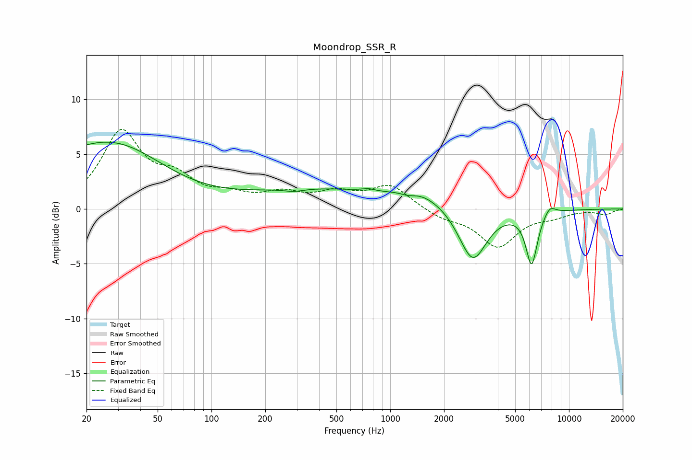

# Moondrop_SSR_R
See [usage instructions](https://github.com/jaakkopasanen/AutoEq#usage) for more options and info.

### Parametric EQs
Apply preamp of -6.2 dB when using parametric equalizer.

|   # | Type    |   Fc (Hz) |    Q |   Gain (dB) |
|-----|---------|-----------|------|-------------|
|   1 | Peaking |        20 | 0.38 |         4.2 |
|   2 | Peaking |        32 | 0.59 |         2.1 |
|   3 | Peaking |       289 | 2.55 |        -0.3 |
|   4 | Peaking |       409 | 0.34 |         1.7 |
|   5 | Peaking |       752 | 4.46 |         0.2 |
|   6 | Peaking |      1261 | 3.49 |        -0.3 |
|   7 | Peaking |      1484 | 1.04 |         1.1 |
|   8 | Peaking |      2895 | 1.82 |        -4.9 |
|   9 | Peaking |      6180 | 4.25 |        -4.8 |
|  10 | Peaking |      7804 | 4.1  |         0.8 |

### Fixed Band EQs
When using fixed band (also called graphic) equalizer, apply preamp of **-7.4 dB** (if available) and set gains manually with these parameters.

|   # | Type    |   Fc (Hz) |    Q |   Gain (dB) |
|-----|---------|-----------|------|-------------|
|   1 | Peaking |        31 | 1.41 |         6.8 |
|   2 | Peaking |        62 | 1.41 |         2.3 |
|   3 | Peaking |       125 | 1.41 |         1   |
|   4 | Peaking |       250 | 1.41 |         1.2 |
|   5 | Peaking |       500 | 1.41 |         1.3 |
|   6 | Peaking |      1000 | 1.41 |         2.1 |
|   7 | Peaking |      2000 | 1.41 |        -0.8 |
|   8 | Peaking |      4000 | 1.41 |        -3.4 |
|   9 | Peaking |      8000 | 1.41 |        -0.5 |
|  10 | Peaking |     16000 | 1.41 |        -0.5 |

### Graphs

