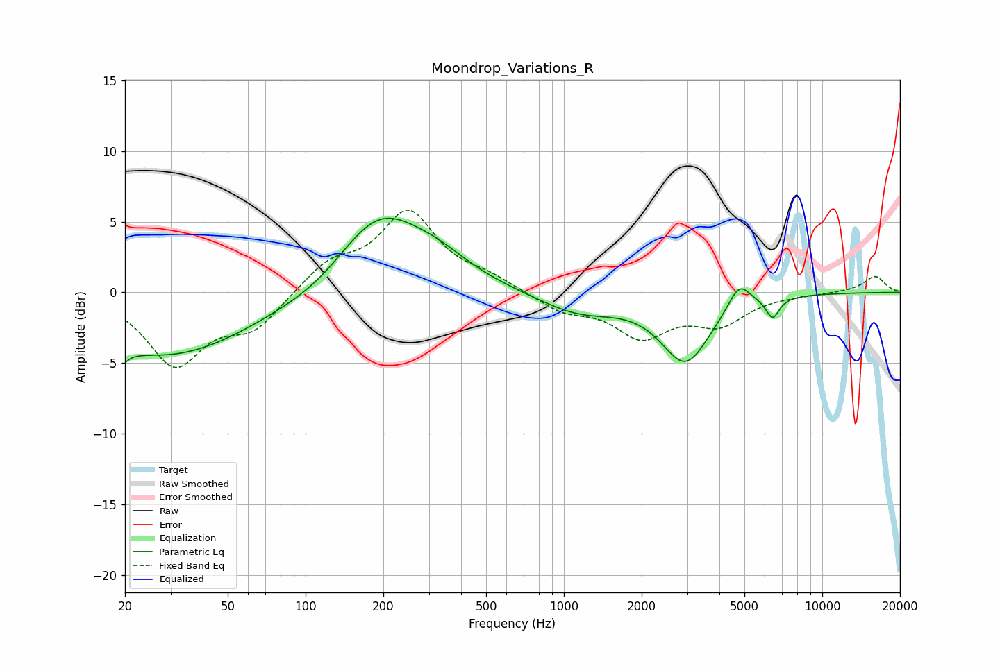

# Moondrop_Variations_R
See [usage instructions](https://github.com/jaakkopasanen/AutoEq#usage) for more options and info.

### Parametric EQs
Apply preamp of -5.3 dB when using parametric equalizer.

|   # | Type    |   Fc (Hz) |    Q |   Gain (dB) |
|-----|---------|-----------|------|-------------|
|   1 | Peaking |        20 | 5.71 |        -4.2 |
|   2 | Peaking |        20 | 5.92 |         3.2 |
|   3 | Peaking |        29 | 0.43 |        -4.5 |
|   4 | Peaking |       119 | 0.88 |        -1.1 |
|   5 | Peaking |       190 | 0.8  |         5.9 |
|   6 | Peaking |       328 | 1.13 |         1.1 |
|   7 | Peaking |      1137 | 0.91 |        -1.5 |
|   8 | Peaking |      2959 | 1.49 |        -4.8 |
|   9 | Peaking |      4770 | 3.29 |         1.8 |
|  10 | Peaking |      6428 | 5.32 |        -1.5 |

### Fixed Band EQs
When using fixed band (also called graphic) equalizer, apply preamp of **-5.9 dB** (if available) and set gains manually with these parameters.

|   # | Type    |   Fc (Hz) |    Q |   Gain (dB) |
|-----|---------|-----------|------|-------------|
|   1 | Peaking |        31 | 1.41 |        -5   |
|   2 | Peaking |        62 | 1.41 |        -2.4 |
|   3 | Peaking |       125 | 1.41 |         1.9 |
|   4 | Peaking |       250 | 1.41 |         5.5 |
|   5 | Peaking |       500 | 1.41 |         0.9 |
|   6 | Peaking |      1000 | 1.41 |        -1.2 |
|   7 | Peaking |      2000 | 1.41 |        -2.9 |
|   8 | Peaking |      4000 | 1.41 |        -2   |
|   9 | Peaking |      8000 | 1.41 |        -0.1 |
|  10 | Peaking |     16000 | 1.41 |         1.2 |

### Graphs

