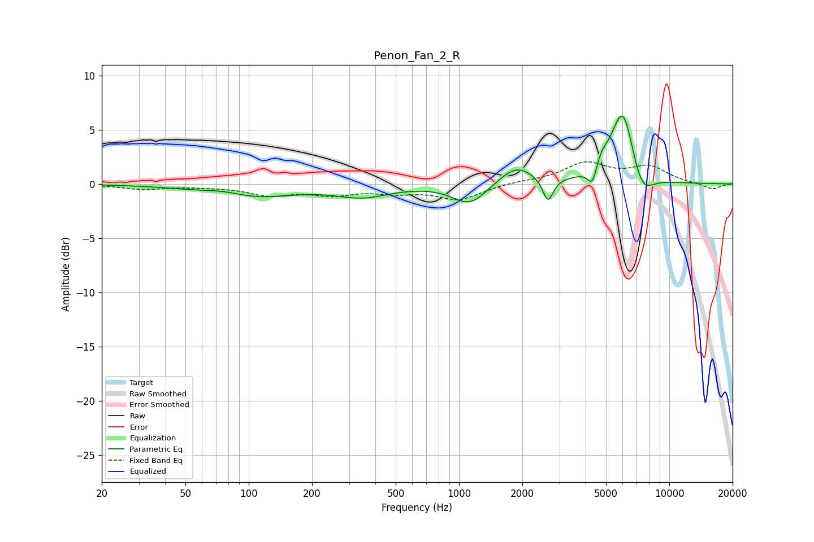

# Penon_Fan_2_R
See [usage instructions](https://github.com/jaakkopasanen/AutoEq#usage) for more options and info.

### Parametric EQs
Apply preamp of -6.3 dB when using parametric equalizer.

|   # | Type    |   Fc (Hz) |    Q |   Gain (dB) |
|-----|---------|-----------|------|-------------|
|   1 | Peaking |        77 | 1.36 |         0.6 |
|   2 | Peaking |        98 | 0.69 |        -1.4 |
|   3 | Peaking |       349 | 1.11 |        -1   |
|   4 | Peaking |      1124 | 1.76 |        -1.9 |
|   5 | Peaking |      1871 | 1.73 |         1.7 |
|   6 | Peaking |      2649 | 5.78 |        -2.2 |
|   7 | Peaking |      4324 | 6    |        -2.1 |
|   8 | Peaking |      4670 | 4.11 |         1.3 |
|   9 | Peaking |      6021 | 2.41 |         7.3 |
|  10 | Peaking |      7340 | 2.47 |        -2.8 |

### Fixed Band EQs
When using fixed band (also called graphic) equalizer, apply preamp of **-2.1 dB** (if available) and set gains manually with these parameters.

|   # | Type    |   Fc (Hz) |    Q |   Gain (dB) |
|-----|---------|-----------|------|-------------|
|   1 | Peaking |        31 | 1.41 |        -0.5 |
|   2 | Peaking |        62 | 1.41 |        -0.1 |
|   3 | Peaking |       125 | 1.41 |        -0.9 |
|   4 | Peaking |       250 | 1.41 |        -0.8 |
|   5 | Peaking |       500 | 1.41 |        -0.6 |
|   6 | Peaking |      1000 | 1.41 |        -1.4 |
|   7 | Peaking |      2000 | 1.41 |         0.2 |
|   8 | Peaking |      4000 | 1.41 |         1.8 |
|   9 | Peaking |      8000 | 1.41 |         1.5 |
|  10 | Peaking |     16000 | 1.41 |        -0.5 |

### Graphs

