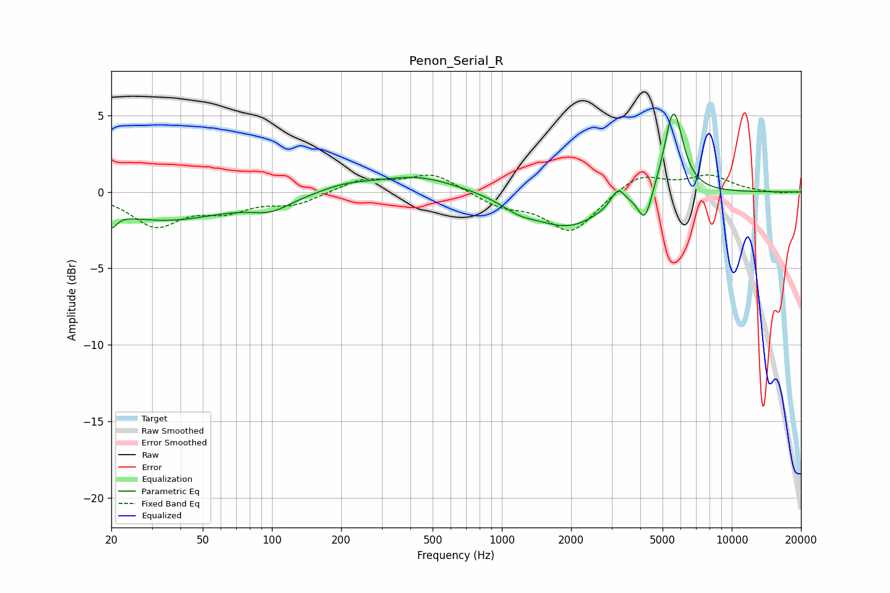

# Penon_Serial_R
See [usage instructions](https://github.com/jaakkopasanen/AutoEq#usage) for more options and info.

### Parametric EQs
Apply preamp of -5.2 dB when using parametric equalizer.

|   # | Type    |   Fc (Hz) |    Q |   Gain (dB) |
|-----|---------|-----------|------|-------------|
|   1 | Peaking |        20 | 5.96 |        -1   |
|   2 | Peaking |        34 | 0.52 |        -1.8 |
|   3 | Peaking |        99 | 1.59 |        -0.8 |
|   4 | Peaking |       208 | 1.32 |         0.4 |
|   5 | Peaking |       425 | 0.78 |         1.1 |
|   6 | Peaking |      1187 | 1.81 |        -0.6 |
|   7 | Peaking |      1948 | 0.93 |        -2.2 |
|   8 | Peaking |      3196 | 4.66 |         1.1 |
|   9 | Peaking |      4190 | 4.74 |        -2   |
|  10 | Peaking |      5581 | 3.42 |         5.6 |

### Fixed Band EQs
When using fixed band (also called graphic) equalizer, apply preamp of **-1.2 dB** (if available) and set gains manually with these parameters.

|   # | Type    |   Fc (Hz) |    Q |   Gain (dB) |
|-----|---------|-----------|------|-------------|
|   1 | Peaking |        31 | 1.41 |        -2.1 |
|   2 | Peaking |        62 | 1.41 |        -1   |
|   3 | Peaking |       125 | 1.41 |        -0.8 |
|   4 | Peaking |       250 | 1.41 |         0.8 |
|   5 | Peaking |       500 | 1.41 |         1.2 |
|   6 | Peaking |      1000 | 1.41 |        -0.9 |
|   7 | Peaking |      2000 | 1.41 |        -2.6 |
|   8 | Peaking |      4000 | 1.41 |         1.2 |
|   9 | Peaking |      8000 | 1.41 |         1   |
|  10 | Peaking |     16000 | 1.41 |        -0.1 |

### Graphs

