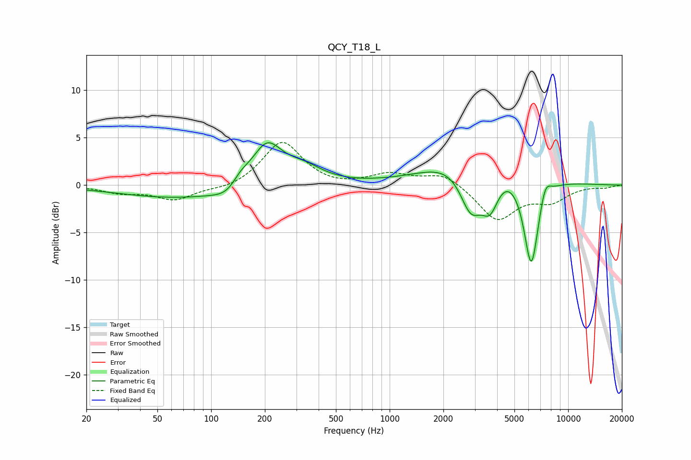

# QCY_T18_L
See [usage instructions](https://github.com/jaakkopasanen/AutoEq#usage) for more options and info.

### Parametric EQs
Apply preamp of -4.6 dB when using parametric equalizer.

|   # | Type    |   Fc (Hz) |    Q |   Gain (dB) |
|-----|---------|-----------|------|-------------|
|   1 | Peaking |        69 | 0.41 |        -1.4 |
|   2 | Peaking |       130 | 1.76 |        -1.6 |
|   3 | Peaking |       144 | 2.55 |         1.5 |
|   4 | Peaking |       205 | 1.65 |         4.5 |
|   5 | Peaking |       327 | 1.28 |         1.6 |
|   6 | Peaking |      2862 | 1.96 |        -6.7 |
|   7 | Peaking |      3213 | 0.73 |         5.8 |
|   8 | Peaking |      3651 | 2.61 |        -4.7 |
|   9 | Peaking |      6211 | 3.17 |       -10.1 |
|  10 | Peaking |      7439 | 4.43 |         1.9 |

### Fixed Band EQs
When using fixed band (also called graphic) equalizer, apply preamp of **-4.6 dB** (if available) and set gains manually with these parameters.

|   # | Type    |   Fc (Hz) |    Q |   Gain (dB) |
|-----|---------|-----------|------|-------------|
|   1 | Peaking |        31 | 1.41 |        -0.7 |
|   2 | Peaking |        62 | 1.41 |        -1.5 |
|   3 | Peaking |       125 | 1.41 |        -0.5 |
|   4 | Peaking |       250 | 1.41 |         4.6 |
|   5 | Peaking |       500 | 1.41 |        -0.3 |
|   6 | Peaking |      1000 | 1.41 |         1.1 |
|   7 | Peaking |      2000 | 1.41 |         1.3 |
|   8 | Peaking |      4000 | 1.41 |        -3.7 |
|   9 | Peaking |      8000 | 1.41 |        -1.5 |
|  10 | Peaking |     16000 | 1.41 |        -0.2 |

### Graphs

