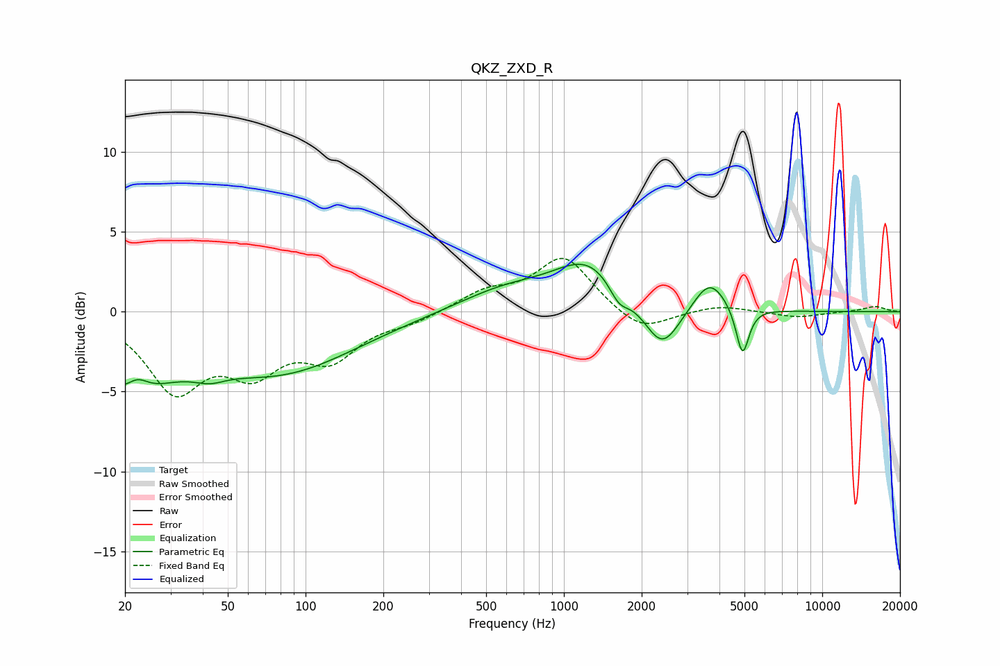

# QKZ_ZXD_R
See [usage instructions](https://github.com/jaakkopasanen/AutoEq#usage) for more options and info.

### Parametric EQs
Apply preamp of -3.1 dB when using parametric equalizer.

|   # | Type    |   Fc (Hz) |    Q |   Gain (dB) |
|-----|---------|-----------|------|-------------|
|   1 | Peaking |        20 | 0.83 |        -4.3 |
|   2 | Peaking |        22 | 3.31 |         0.9 |
|   3 | Peaking |        42 | 2.33 |        -0.6 |
|   4 | Peaking |        80 | 0.48 |        -3.6 |
|   5 | Peaking |       595 | 0.76 |         1.3 |
|   6 | Peaking |      1250 | 1.06 |         2.9 |
|   7 | Peaking |      1633 | 3.63 |        -1.2 |
|   8 | Peaking |      2396 | 2.02 |        -3   |
|   9 | Peaking |      3667 | 2.24 |         2.1 |
|  10 | Peaking |      4913 | 5.65 |        -3.1 |

### Fixed Band EQs
When using fixed band (also called graphic) equalizer, apply preamp of **-3.4 dB** (if available) and set gains manually with these parameters.

|   # | Type    |   Fc (Hz) |    Q |   Gain (dB) |
|-----|---------|-----------|------|-------------|
|   1 | Peaking |        31 | 1.41 |        -4.6 |
|   2 | Peaking |        62 | 1.41 |        -3.1 |
|   3 | Peaking |       125 | 1.41 |        -2.6 |
|   4 | Peaking |       250 | 1.41 |        -0.5 |
|   5 | Peaking |       500 | 1.41 |         1.1 |
|   6 | Peaking |      1000 | 1.41 |         3.4 |
|   7 | Peaking |      2000 | 1.41 |        -1.4 |
|   8 | Peaking |      4000 | 1.41 |         0.4 |
|   9 | Peaking |      8000 | 1.41 |        -0.4 |
|  10 | Peaking |     16000 | 1.41 |         0.3 |

### Graphs

