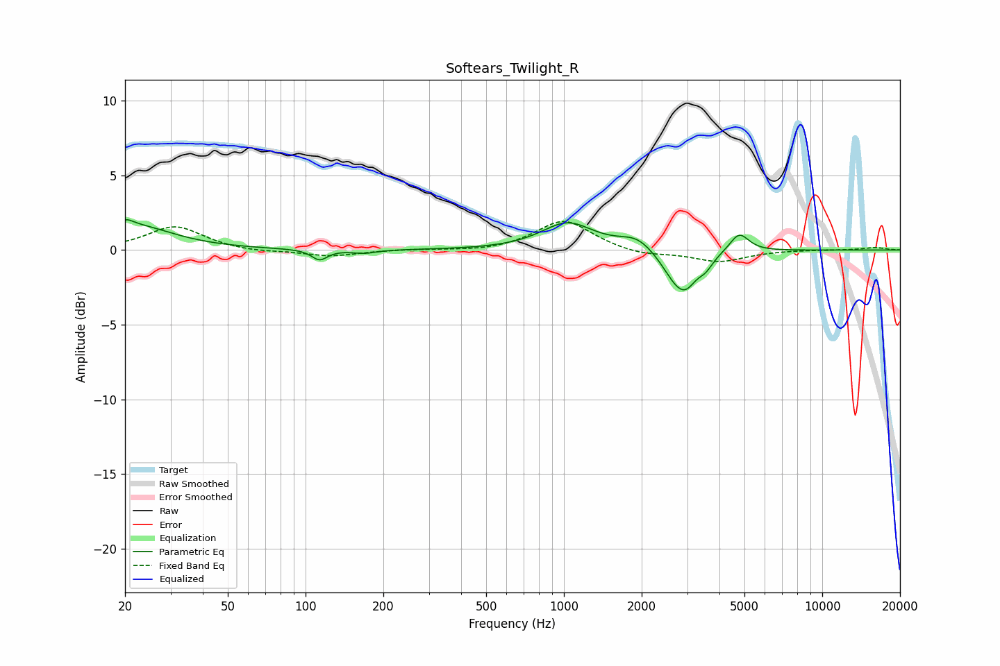

# Softears_Twilight_R
See [usage instructions](https://github.com/jaakkopasanen/AutoEq#usage) for more options and info.

### Parametric EQs
Apply preamp of -2.1 dB when using parametric equalizer.

|   # | Type    |   Fc (Hz) |    Q |   Gain (dB) |
|-----|---------|-----------|------|-------------|
|   1 | Peaking |        20 | 4.85 |         0.5 |
|   2 | Peaking |        22 | 0.95 |         1.6 |
|   3 | Peaking |       113 | 4.68 |        -0.7 |
|   4 | Peaking |       169 | 3    |        -0.2 |
|   5 | Peaking |      1033 | 1.42 |         1.8 |
|   6 | Peaking |      1929 | 2.03 |         0.9 |
|   7 | Peaking |      2819 | 2.25 |        -2.7 |
|   8 | Peaking |      3002 | 4.54 |        -0.4 |
|   9 | Peaking |      3537 | 5.45 |        -0.5 |
|  10 | Peaking |      4768 | 3.73 |         1.3 |

### Fixed Band EQs
When using fixed band (also called graphic) equalizer, apply preamp of **-2.0 dB** (if available) and set gains manually with these parameters.

|   # | Type    |   Fc (Hz) |    Q |   Gain (dB) |
|-----|---------|-----------|------|-------------|
|   1 | Peaking |        31 | 1.41 |         1.6 |
|   2 | Peaking |        62 | 1.41 |        -0.2 |
|   3 | Peaking |       125 | 1.41 |        -0.4 |
|   4 | Peaking |       250 | 1.41 |         0   |
|   5 | Peaking |       500 | 1.41 |        -0.1 |
|   6 | Peaking |      1000 | 1.41 |         2   |
|   7 | Peaking |      2000 | 1.41 |        -0.4 |
|   8 | Peaking |      4000 | 1.41 |        -0.8 |
|   9 | Peaking |      8000 | 1.41 |         0   |
|  10 | Peaking |     16000 | 1.41 |         0.2 |

### Graphs

