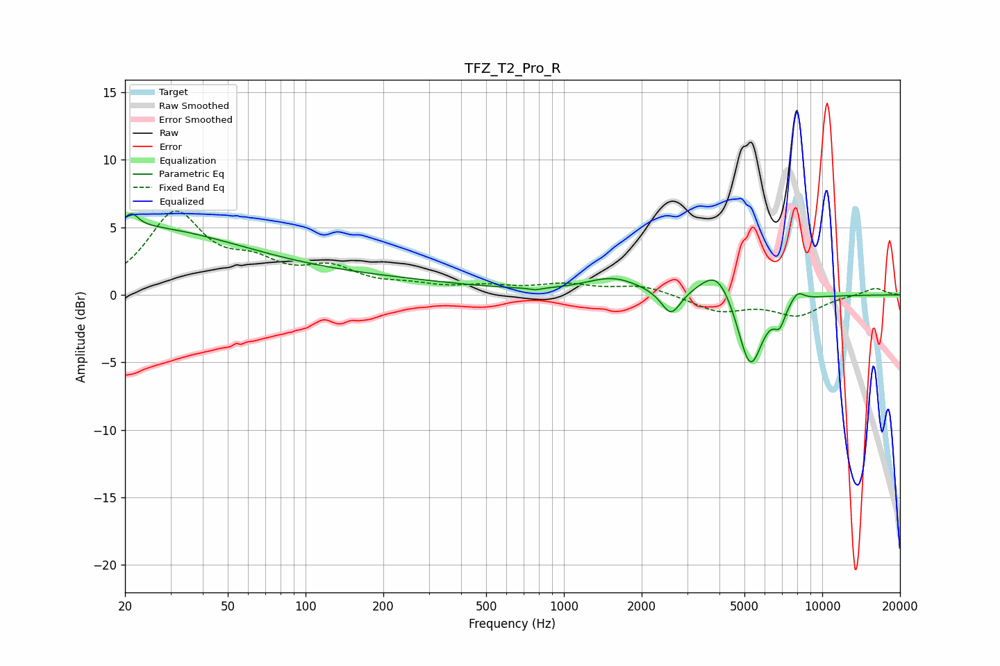

# TFZ_T2_Pro_R
See [usage instructions](https://github.com/jaakkopasanen/AutoEq#usage) for more options and info.

### Parametric EQs
Apply preamp of -6.1 dB when using parametric equalizer.

|   # | Type    |   Fc (Hz) |    Q |   Gain (dB) |
|-----|---------|-----------|------|-------------|
|   1 | Peaking |        20 | 0.32 |         4.9 |
|   2 | Peaking |        21 | 5.66 |         1   |
|   3 | Peaking |       158 | 0.35 |         1   |
|   4 | Peaking |       777 | 5.97 |        -0.2 |
|   5 | Peaking |      1547 | 1.31 |         1.2 |
|   6 | Peaking |      2597 | 3.79 |        -1.9 |
|   7 | Peaking |      3924 | 2.16 |         2.3 |
|   8 | Peaking |      5260 | 2.83 |        -5.7 |
|   9 | Peaking |      6842 | 5.99 |        -1.4 |
|  10 | Peaking |      8016 | 5.11 |         0.8 |

### Fixed Band EQs
When using fixed band (also called graphic) equalizer, apply preamp of **-6.3 dB** (if available) and set gains manually with these parameters.

|   # | Type    |   Fc (Hz) |    Q |   Gain (dB) |
|-----|---------|-----------|------|-------------|
|   1 | Peaking |        31 | 1.41 |         5.8 |
|   2 | Peaking |        62 | 1.41 |         1.8 |
|   3 | Peaking |       125 | 1.41 |         1.7 |
|   4 | Peaking |       250 | 1.41 |         0.5 |
|   5 | Peaking |       500 | 1.41 |         0.5 |
|   6 | Peaking |      1000 | 1.41 |         0.7 |
|   7 | Peaking |      2000 | 1.41 |         0.7 |
|   8 | Peaking |      4000 | 1.41 |        -1.2 |
|   9 | Peaking |      8000 | 1.41 |        -1.5 |
|  10 | Peaking |     16000 | 1.41 |         0.6 |

### Graphs

