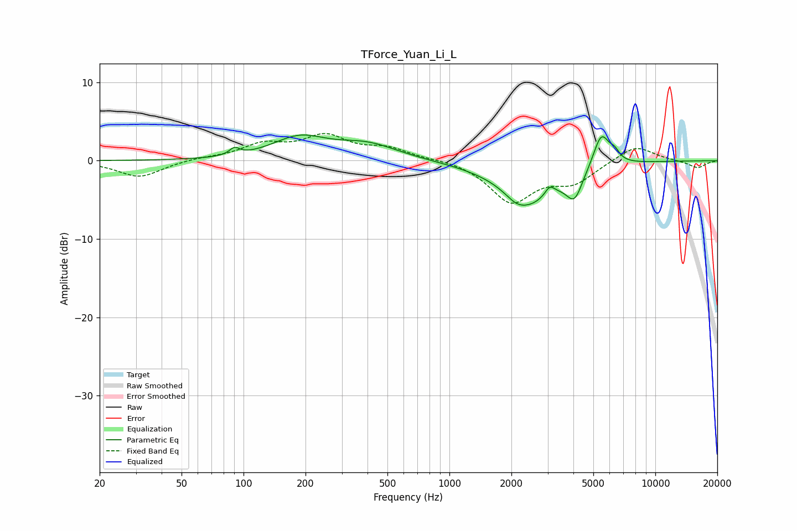

# TForce_Yuan_Li_L
See [usage instructions](https://github.com/jaakkopasanen/AutoEq#usage) for more options and info.

### Parametric EQs
Apply preamp of -3.4 dB when using parametric equalizer.

|   # | Type    |   Fc (Hz) |    Q |   Gain (dB) |
|-----|---------|-----------|------|-------------|
|   1 | Peaking |        90 | 5.98 |         0.9 |
|   2 | Peaking |       187 | 1.08 |         2.7 |
|   3 | Peaking |       399 | 0.94 |         1.9 |
|   4 | Peaking |      1803 | 1.41 |         0.6 |
|   5 | Peaking |      2107 | 3.22 |        -0.5 |
|   6 | Peaking |      2353 | 1.01 |        -5.8 |
|   7 | Peaking |      3072 | 6    |         1.2 |
|   8 | Peaking |      4049 | 3.6  |        -3.3 |
|   9 | Peaking |      5468 | 3.49 |         4.4 |
|  10 | Peaking |      6343 | 5.99 |         1   |

### Fixed Band EQs
When using fixed band (also called graphic) equalizer, apply preamp of **-3.6 dB** (if available) and set gains manually with these parameters.

|   # | Type    |   Fc (Hz) |    Q |   Gain (dB) |
|-----|---------|-----------|------|-------------|
|   1 | Peaking |        31 | 1.41 |        -2.1 |
|   2 | Peaking |        62 | 1.41 |         0.3 |
|   3 | Peaking |       125 | 1.41 |         1.9 |
|   4 | Peaking |       250 | 1.41 |         2.9 |
|   5 | Peaking |       500 | 1.41 |         1.4 |
|   6 | Peaking |      1000 | 1.41 |         0.2 |
|   7 | Peaking |      2000 | 1.41 |        -5.2 |
|   8 | Peaking |      4000 | 1.41 |        -2.5 |
|   9 | Peaking |      8000 | 1.41 |         2.1 |
|  10 | Peaking |     16000 | 1.41 |        -0.9 |

### Graphs

