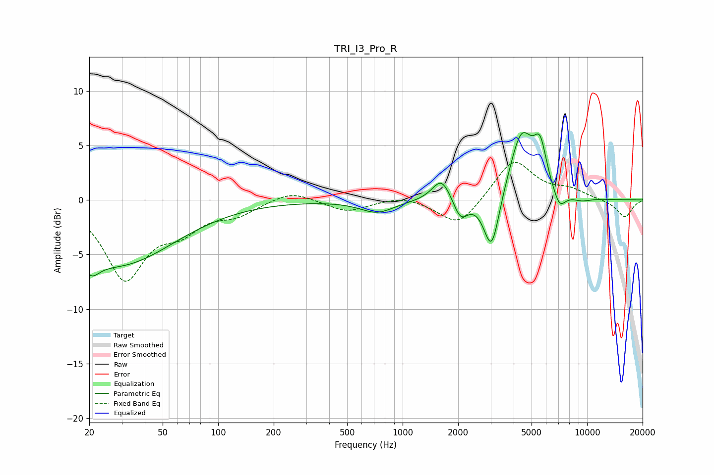

# TRI_I3_Pro_R
See [usage instructions](https://github.com/jaakkopasanen/AutoEq#usage) for more options and info.

### Parametric EQs
Apply preamp of -6.3 dB when using parametric equalizer.

|   # | Type    |   Fc (Hz) |    Q |   Gain (dB) |
|-----|---------|-----------|------|-------------|
|   1 | Peaking |        20 | 3.12 |        -1.7 |
|   2 | Peaking |        29 | 0.47 |        -5.8 |
|   3 | Peaking |       727 | 1.53 |        -1.1 |
|   4 | Peaking |      1626 | 2.85 |         2.1 |
|   5 | Peaking |      2062 | 3.57 |        -1.9 |
|   6 | Peaking |      3037 | 3.31 |        -5.4 |
|   7 | Peaking |      4407 | 2.12 |         6.1 |
|   8 | Peaking |      5569 | 3.96 |         3.6 |
|   9 | Peaking |      7076 | 3.98 |        -1.6 |
|  10 | Peaking |      9344 | 2.54 |        -0.3 |

### Fixed Band EQs
When using fixed band (also called graphic) equalizer, apply preamp of **-3.5 dB** (if available) and set gains manually with these parameters.

|   # | Type    |   Fc (Hz) |    Q |   Gain (dB) |
|-----|---------|-----------|------|-------------|
|   1 | Peaking |        31 | 1.41 |        -7   |
|   2 | Peaking |        62 | 1.41 |        -2.2 |
|   3 | Peaking |       125 | 1.41 |        -1.1 |
|   4 | Peaking |       250 | 1.41 |         0.9 |
|   5 | Peaking |       500 | 1.41 |        -1.1 |
|   6 | Peaking |      1000 | 1.41 |         0.5 |
|   7 | Peaking |      2000 | 1.41 |        -2.5 |
|   8 | Peaking |      4000 | 1.41 |         3.7 |
|   9 | Peaking |      8000 | 1.41 |         0.8 |
|  10 | Peaking |     16000 | 1.41 |        -1.6 |

### Graphs

