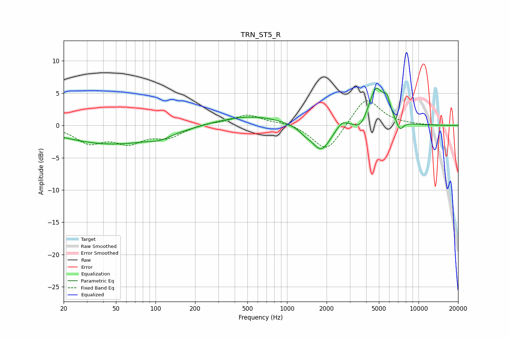

# TRN_ST5_R
See [usage instructions](https://github.com/jaakkopasanen/AutoEq#usage) for more options and info.

### Parametric EQs
Apply preamp of -5.9 dB when using parametric equalizer.

|   # | Type    |   Fc (Hz) |    Q |   Gain (dB) |
|-----|---------|-----------|------|-------------|
|   1 | Peaking |        47 | 0.38 |        -2.9 |
|   2 | Peaking |       109 | 1.87 |        -0.6 |
|   3 | Peaking |       514 | 0.54 |         1.6 |
|   4 | Peaking |      1373 | 2.75 |        -0.8 |
|   5 | Peaking |      1825 | 2.04 |        -4   |
|   6 | Peaking |      2625 | 3.56 |         1.1 |
|   7 | Peaking |      3628 | 3.29 |        -1.4 |
|   8 | Peaking |      4763 | 2.51 |         5.8 |
|   9 | Peaking |      5759 | 5.36 |         2.4 |
|  10 | Peaking |      7232 | 5.37 |        -1.5 |

### Fixed Band EQs
When using fixed band (also called graphic) equalizer, apply preamp of **-3.9 dB** (if available) and set gains manually with these parameters.

|   # | Type    |   Fc (Hz) |    Q |   Gain (dB) |
|-----|---------|-----------|------|-------------|
|   1 | Peaking |        31 | 1.41 |        -2.5 |
|   2 | Peaking |        62 | 1.41 |        -2.4 |
|   3 | Peaking |       125 | 1.41 |        -1.7 |
|   4 | Peaking |       250 | 1.41 |         0.4 |
|   5 | Peaking |       500 | 1.41 |         1.6 |
|   6 | Peaking |      1000 | 1.41 |         0.5 |
|   7 | Peaking |      2000 | 1.41 |        -4.3 |
|   8 | Peaking |      4000 | 1.41 |         4.5 |
|   9 | Peaking |      8000 | 1.41 |         0.1 |
|  10 | Peaking |     16000 | 1.41 |        -0   |

### Graphs

