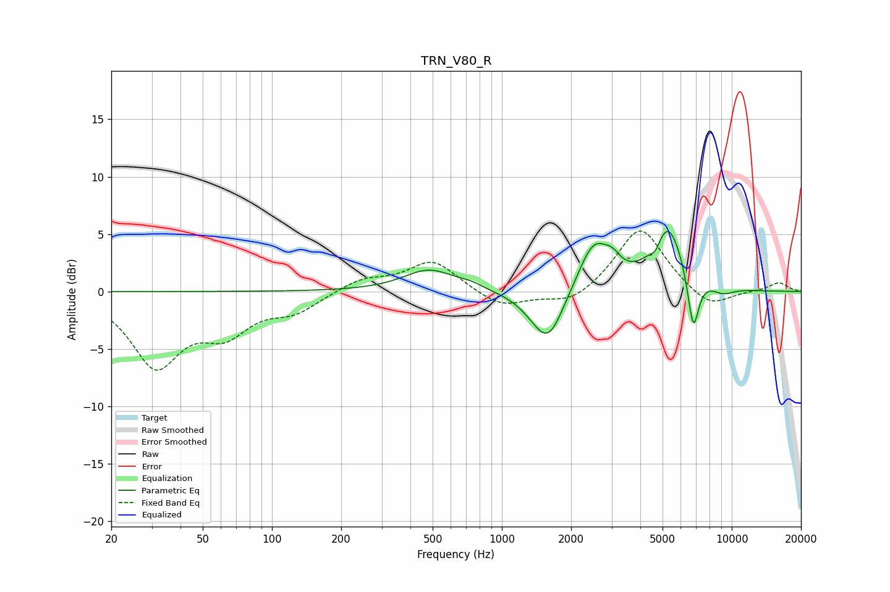

# TRN_V80_R
See [usage instructions](https://github.com/jaakkopasanen/AutoEq#usage) for more options and info.

### Parametric EQs
Apply preamp of -5.3 dB when using parametric equalizer.

|   # | Type    |   Fc (Hz) |    Q |   Gain (dB) |
|-----|---------|-----------|------|-------------|
|   1 | Peaking |       483 | 1.27 |         1.9 |
|   2 | Peaking |       731 | 2.63 |         0.3 |
|   3 | Peaking |      1451 | 1.71 |        -1.1 |
|   4 | Peaking |      1601 | 2.13 |        -3.8 |
|   5 | Peaking |      2511 | 2.05 |         4.2 |
|   6 | Peaking |      3032 | 4.1  |         1   |
|   7 | Peaking |      4661 | 6    |        -1   |
|   8 | Peaking |      5266 | 2.01 |         5.7 |
|   9 | Peaking |      6800 | 5.61 |        -5.1 |
|  10 | Peaking |      9150 | 2.76 |        -0.6 |

### Fixed Band EQs
When using fixed band (also called graphic) equalizer, apply preamp of **-5.4 dB** (if available) and set gains manually with these parameters.

|   # | Type    |   Fc (Hz) |    Q |   Gain (dB) |
|-----|---------|-----------|------|-------------|
|   1 | Peaking |        31 | 1.41 |        -6.2 |
|   2 | Peaking |        62 | 1.41 |        -3.1 |
|   3 | Peaking |       125 | 1.41 |        -1.5 |
|   4 | Peaking |       250 | 1.41 |         1.1 |
|   5 | Peaking |       500 | 1.41 |         2.7 |
|   6 | Peaking |      1000 | 1.41 |        -1.4 |
|   7 | Peaking |      2000 | 1.41 |        -1.2 |
|   8 | Peaking |      4000 | 1.41 |         5.7 |
|   9 | Peaking |      8000 | 1.41 |        -1.6 |
|  10 | Peaking |     16000 | 1.41 |         0.8 |

### Graphs

