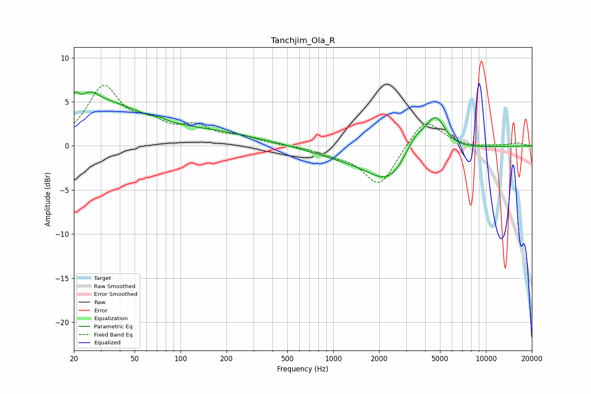

# Tanchjim_Ola_R
See [usage instructions](https://github.com/jaakkopasanen/AutoEq#usage) for more options and info.

### Parametric EQs
Apply preamp of -6.2 dB when using parametric equalizer.

|   # | Type    |   Fc (Hz) |    Q |   Gain (dB) |
|-----|---------|-----------|------|-------------|
|   1 | Peaking |        20 | 5.99 |         2   |
|   2 | Peaking |        25 | 1.86 |         2.6 |
|   3 | Peaking |        35 | 0.72 |         2.8 |
|   4 | Peaking |        74 | 4.86 |         0.2 |
|   5 | Peaking |       124 | 0.2  |         1.9 |
|   6 | Peaking |       326 | 0.79 |        -0.2 |
|   7 | Peaking |      1566 | 0.33 |        -1.7 |
|   8 | Peaking |      2357 | 1.09 |        -3.1 |
|   9 | Peaking |      3427 | 1.76 |         2.7 |
|  10 | Peaking |      4697 | 2.14 |         3.8 |

### Fixed Band EQs
When using fixed band (also called graphic) equalizer, apply preamp of **-7.0 dB** (if available) and set gains manually with these parameters.

|   # | Type    |   Fc (Hz) |    Q |   Gain (dB) |
|-----|---------|-----------|------|-------------|
|   1 | Peaking |        31 | 1.41 |         6.4 |
|   2 | Peaking |        62 | 1.41 |         2   |
|   3 | Peaking |       125 | 1.41 |         1.8 |
|   4 | Peaking |       250 | 1.41 |         0.9 |
|   5 | Peaking |       500 | 1.41 |         0   |
|   6 | Peaking |      1000 | 1.41 |        -0.7 |
|   7 | Peaking |      2000 | 1.41 |        -4.6 |
|   8 | Peaking |      4000 | 1.41 |         3.3 |
|   9 | Peaking |      8000 | 1.41 |        -0.2 |
|  10 | Peaking |     16000 | 1.41 |         0.3 |

### Graphs

