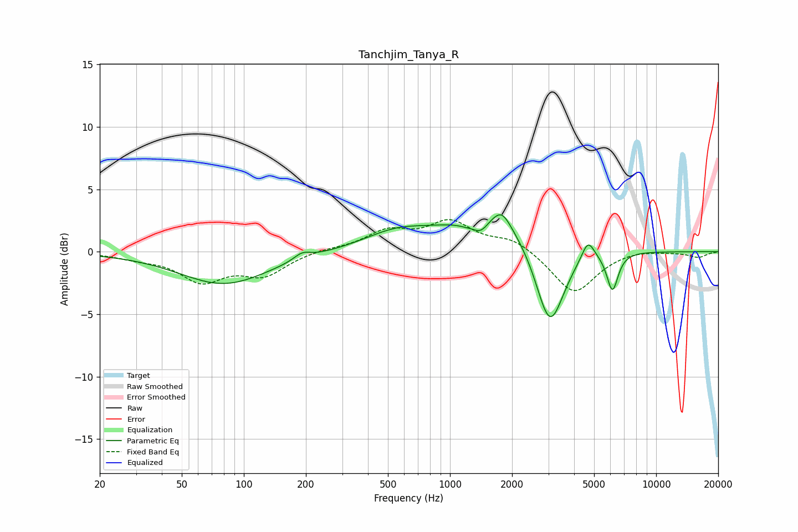

# Tanchjim_Tanya_R
See [usage instructions](https://github.com/jaakkopasanen/AutoEq#usage) for more options and info.

### Parametric EQs
Apply preamp of -3.1 dB when using parametric equalizer.

|   # | Type    |   Fc (Hz) |    Q |   Gain (dB) |
|-----|---------|-----------|------|-------------|
|   1 | Peaking |        80 | 0.66 |        -2.6 |
|   2 | Peaking |       192 | 3.59 |         0.6 |
|   3 | Peaking |       547 | 0.88 |         1.3 |
|   4 | Peaking |      1226 | 2.6  |        -0.4 |
|   5 | Peaking |      1413 | 3.82 |        -0.9 |
|   6 | Peaking |      1665 | 0.63 |         3   |
|   7 | Peaking |      1782 | 3.27 |         1.3 |
|   8 | Peaking |      3051 | 1.99 |        -7.1 |
|   9 | Peaking |      4670 | 4.5  |         1.6 |
|  10 | Peaking |      6139 | 5.03 |        -3.1 |

### Fixed Band EQs
When using fixed band (also called graphic) equalizer, apply preamp of **-2.7 dB** (if available) and set gains manually with these parameters.

|   # | Type    |   Fc (Hz) |    Q |   Gain (dB) |
|-----|---------|-----------|------|-------------|
|   1 | Peaking |        31 | 1.41 |        -0.4 |
|   2 | Peaking |        62 | 1.41 |        -2.2 |
|   3 | Peaking |       125 | 1.41 |        -1.7 |
|   4 | Peaking |       250 | 1.41 |         0.2 |
|   5 | Peaking |       500 | 1.41 |         1.5 |
|   6 | Peaking |      1000 | 1.41 |         2.2 |
|   7 | Peaking |      2000 | 1.41 |         1   |
|   8 | Peaking |      4000 | 1.41 |        -3.4 |
|   9 | Peaking |      8000 | 1.41 |         0.2 |
|  10 | Peaking |     16000 | 1.41 |        -0.4 |

### Graphs

