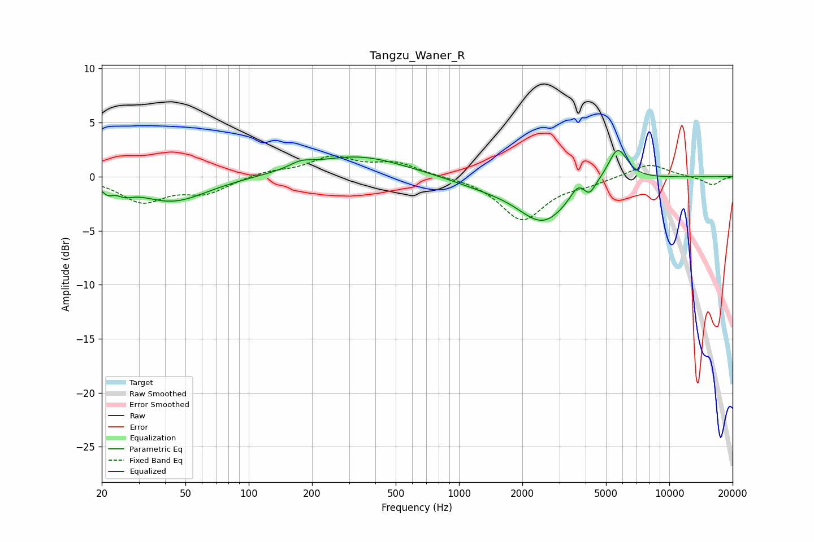

# Tangzu_Waner_R
See [usage instructions](https://github.com/jaakkopasanen/AutoEq#usage) for more options and info.

### Parametric EQs
Apply preamp of -2.5 dB when using parametric equalizer.

|   # | Type    |   Fc (Hz) |    Q |   Gain (dB) |
|-----|---------|-----------|------|-------------|
|   1 | Peaking |        21 | 5.54 |        -0.7 |
|   2 | Peaking |        26 | 3.73 |        -0.6 |
|   3 | Peaking |        43 | 0.85 |        -2.3 |
|   4 | Peaking |       177 | 2.65 |         0.6 |
|   5 | Peaking |       329 | 0.62 |         1.9 |
|   6 | Peaking |      1327 | 0.83 |        -0.7 |
|   7 | Peaking |      2519 | 1.17 |        -4   |
|   8 | Peaking |      3674 | 4.14 |         1.1 |
|   9 | Peaking |      4171 | 5.46 |        -1   |
|  10 | Peaking |      5682 | 2.96 |         3.1 |

### Fixed Band EQs
When using fixed band (also called graphic) equalizer, apply preamp of **-2.0 dB** (if available) and set gains manually with these parameters.

|   # | Type    |   Fc (Hz) |    Q |   Gain (dB) |
|-----|---------|-----------|------|-------------|
|   1 | Peaking |        31 | 1.41 |        -2.2 |
|   2 | Peaking |        62 | 1.41 |        -1.4 |
|   3 | Peaking |       125 | 1.41 |         0.5 |
|   4 | Peaking |       250 | 1.41 |         1.7 |
|   5 | Peaking |       500 | 1.41 |         1.2 |
|   6 | Peaking |      1000 | 1.41 |         0   |
|   7 | Peaking |      2000 | 1.41 |        -4   |
|   8 | Peaking |      4000 | 1.41 |        -0.5 |
|   9 | Peaking |      8000 | 1.41 |         1.3 |
|  10 | Peaking |     16000 | 1.41 |        -0.8 |

### Graphs

