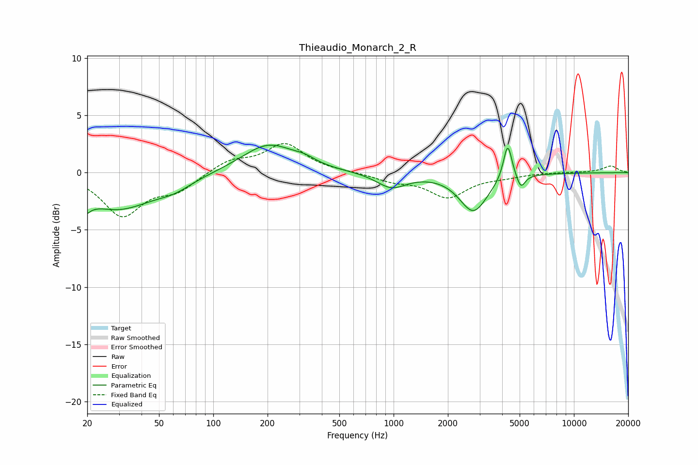

# Thieaudio_Monarch_2_R
See [usage instructions](https://github.com/jaakkopasanen/AutoEq#usage) for more options and info.

### Parametric EQs
Apply preamp of -2.5 dB when using parametric equalizer.

|   # | Type    |   Fc (Hz) |    Q |   Gain (dB) |
|-----|---------|-----------|------|-------------|
|   1 | Peaking |        20 | 5.4  |        -3.3 |
|   2 | Peaking |        20 | 5.99 |         2.1 |
|   3 | Peaking |        29 | 0.7  |        -3.1 |
|   4 | Peaking |        61 | 1.45 |        -0.7 |
|   5 | Peaking |       202 | 0.96 |         2.5 |
|   6 | Peaking |       321 | 2.28 |         0.4 |
|   7 | Peaking |       974 | 1.71 |        -1.3 |
|   8 | Peaking |      2773 | 1.82 |        -3.3 |
|   9 | Peaking |      4291 | 5.92 |         3.2 |
|  10 | Peaking |      5076 | 6    |        -1.2 |

### Fixed Band EQs
When using fixed band (also called graphic) equalizer, apply preamp of **-2.6 dB** (if available) and set gains manually with these parameters.

|   # | Type    |   Fc (Hz) |    Q |   Gain (dB) |
|-----|---------|-----------|------|-------------|
|   1 | Peaking |        31 | 1.41 |        -3.7 |
|   2 | Peaking |        62 | 1.41 |        -1.4 |
|   3 | Peaking |       125 | 1.41 |         1   |
|   4 | Peaking |       250 | 1.41 |         2.5 |
|   5 | Peaking |       500 | 1.41 |         0.1 |
|   6 | Peaking |      1000 | 1.41 |        -0.6 |
|   7 | Peaking |      2000 | 1.41 |        -2.1 |
|   8 | Peaking |      4000 | 1.41 |        -0.3 |
|   9 | Peaking |      8000 | 1.41 |         0   |
|  10 | Peaking |     16000 | 1.41 |         0.6 |

### Graphs

