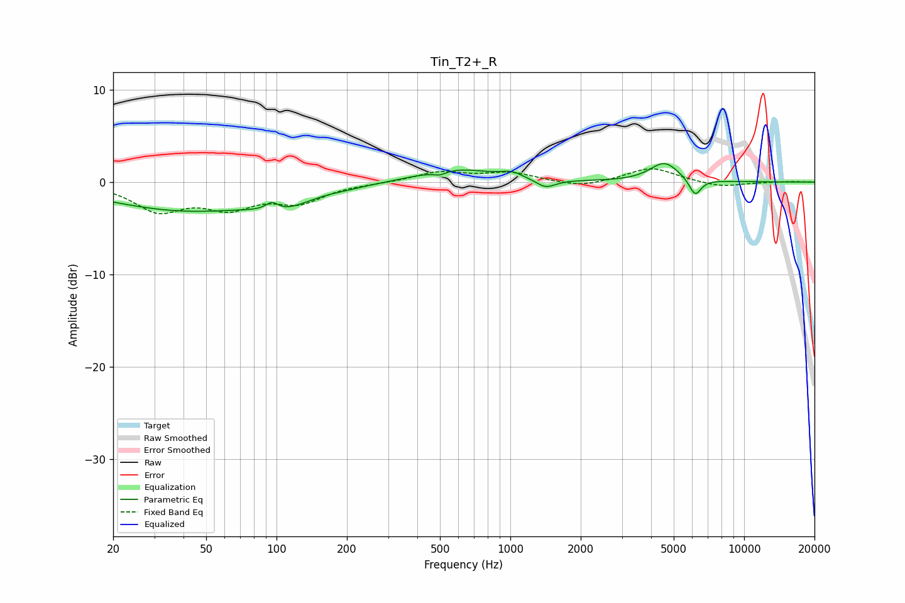

# Tin_T2+_R
See [usage instructions](https://github.com/jaakkopasanen/AutoEq#usage) for more options and info.

### Parametric EQs
Apply preamp of -2.1 dB when using parametric equalizer.

|   # | Type    |   Fc (Hz) |    Q |   Gain (dB) |
|-----|---------|-----------|------|-------------|
|   1 | Peaking |        41 | 0.41 |        -3   |
|   2 | Peaking |        96 | 5.03 |         1   |
|   3 | Peaking |       107 | 1.3  |        -1.4 |
|   4 | Peaking |       206 | 2.01 |        -0.1 |
|   5 | Peaking |       499 | 4.91 |        -0.4 |
|   6 | Peaking |       579 | 0.9  |         1.5 |
|   7 | Peaking |      1013 | 3.08 |         0.6 |
|   8 | Peaking |      1417 | 3.42 |        -0.9 |
|   9 | Peaking |      4564 | 2.23 |         2.1 |
|  10 | Peaking |      6172 | 5.35 |        -1.9 |

### Fixed Band EQs
When using fixed band (also called graphic) equalizer, apply preamp of **-1.5 dB** (if available) and set gains manually with these parameters.

|   # | Type    |   Fc (Hz) |    Q |   Gain (dB) |
|-----|---------|-----------|------|-------------|
|   1 | Peaking |        31 | 1.41 |        -2.9 |
|   2 | Peaking |        62 | 1.41 |        -2.4 |
|   3 | Peaking |       125 | 1.41 |        -2   |
|   4 | Peaking |       250 | 1.41 |        -0.1 |
|   5 | Peaking |       500 | 1.41 |         1.1 |
|   6 | Peaking |      1000 | 1.41 |         1   |
|   7 | Peaking |      2000 | 1.41 |        -0.6 |
|   8 | Peaking |      4000 | 1.41 |         1.6 |
|   9 | Peaking |      8000 | 1.41 |        -0.6 |
|  10 | Peaking |     16000 | 1.41 |         0.1 |

### Graphs

