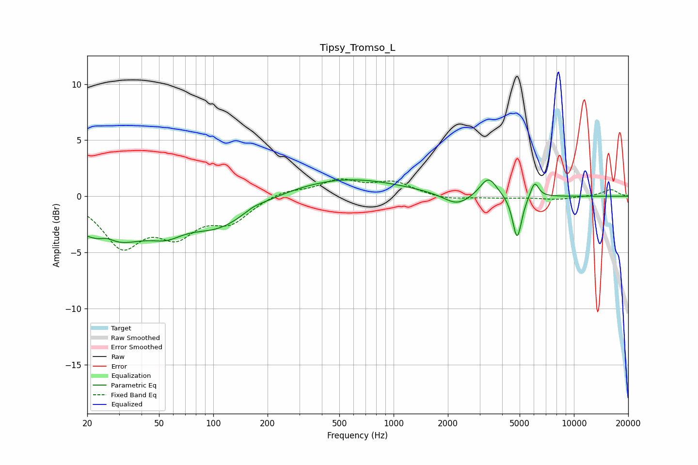

# Tipsy_Tromso_L
See [usage instructions](https://github.com/jaakkopasanen/AutoEq#usage) for more options and info.

### Parametric EQs
Apply preamp of -1.6 dB when using parametric equalizer.

|   # | Type    |   Fc (Hz) |    Q |   Gain (dB) |
|-----|---------|-----------|------|-------------|
|   1 | Peaking |        26 | 3.67 |         0.5 |
|   2 | Peaking |        27 | 0.63 |        -3.9 |
|   3 | Peaking |        55 | 1.61 |        -1.1 |
|   4 | Peaking |       107 | 0.83 |        -2.4 |
|   5 | Peaking |       167 | 2.85 |         0.3 |
|   6 | Peaking |       536 | 0.45 |         1.6 |
|   7 | Peaking |      2246 | 1.85 |        -1.1 |
|   8 | Peaking |      3357 | 3.05 |         1.8 |
|   9 | Peaking |      4843 | 5.61 |        -3.9 |
|  10 | Peaking |      6051 | 5.92 |         1.4 |

### Fixed Band EQs
When using fixed band (also called graphic) equalizer, apply preamp of **-1.6 dB** (if available) and set gains manually with these parameters.

|   # | Type    |   Fc (Hz) |    Q |   Gain (dB) |
|-----|---------|-----------|------|-------------|
|   1 | Peaking |        31 | 1.41 |        -4.2 |
|   2 | Peaking |        62 | 1.41 |        -2.9 |
|   3 | Peaking |       125 | 1.41 |        -2   |
|   4 | Peaking |       250 | 1.41 |         0.6 |
|   5 | Peaking |       500 | 1.41 |         1.3 |
|   6 | Peaking |      1000 | 1.41 |         1.2 |
|   7 | Peaking |      2000 | 1.41 |        -0.3 |
|   8 | Peaking |      4000 | 1.41 |        -0.1 |
|   9 | Peaking |      8000 | 1.41 |        -0.3 |
|  10 | Peaking |     16000 | 1.41 |         0.6 |

### Graphs

