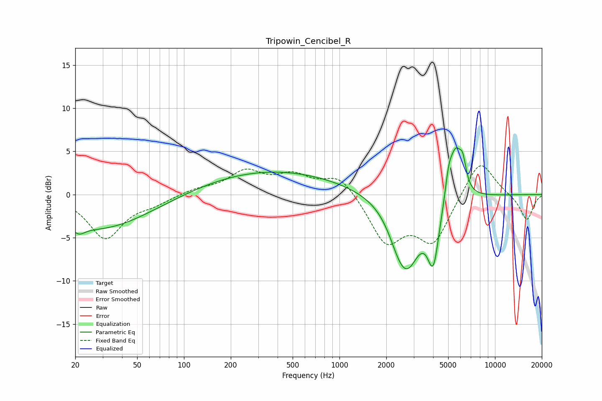

# Tripowin_Cencibel_R
See [usage instructions](https://github.com/jaakkopasanen/AutoEq#usage) for more options and info.

### Parametric EQs
Apply preamp of -5.5 dB when using parametric equalizer.

|   # | Type    |   Fc (Hz) |    Q |   Gain (dB) |
|-----|---------|-----------|------|-------------|
|   1 | Peaking |        21 | 3.84 |        -0.9 |
|   2 | Peaking |        28 | 0.43 |        -4   |
|   3 | Peaking |       365 | 0.32 |         2.8 |
|   4 | Peaking |      2347 | 2.47 |        -1.3 |
|   5 | Peaking |      2723 | 1.72 |        -8.6 |
|   6 | Peaking |      2739 | 2.88 |         0.8 |
|   7 | Peaking |      4013 | 3.8  |        -6.4 |
|   8 | Peaking |      5046 | 5.64 |         3   |
|   9 | Peaking |      5587 | 3.86 |         5   |
|  10 | Peaking |      6198 | 6    |         2.9 |

### Fixed Band EQs
When using fixed band (also called graphic) equalizer, apply preamp of **-3.4 dB** (if available) and set gains manually with these parameters.

|   # | Type    |   Fc (Hz) |    Q |   Gain (dB) |
|-----|---------|-----------|------|-------------|
|   1 | Peaking |        31 | 1.41 |        -5   |
|   2 | Peaking |        62 | 1.41 |        -0.8 |
|   3 | Peaking |       125 | 1.41 |         0.6 |
|   4 | Peaking |       250 | 1.41 |         2.5 |
|   5 | Peaking |       500 | 1.41 |         2   |
|   6 | Peaking |      1000 | 1.41 |         2.4 |
|   7 | Peaking |      2000 | 1.41 |        -5.4 |
|   8 | Peaking |      4000 | 1.41 |        -5.3 |
|   9 | Peaking |      8000 | 1.41 |         4.4 |
|  10 | Peaking |     16000 | 1.41 |        -3   |

### Graphs

