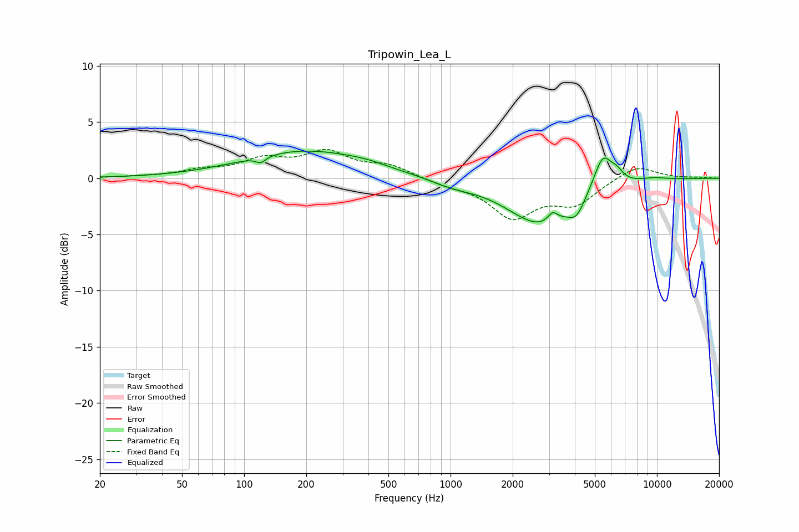

# Tripowin_Lea_L
See [usage instructions](https://github.com/jaakkopasanen/AutoEq#usage) for more options and info.

### Parametric EQs
Apply preamp of -2.5 dB when using parametric equalizer.

|   # | Type    |   Fc (Hz) |    Q |   Gain (dB) |
|-----|---------|-----------|------|-------------|
|   1 | Peaking |       120 | 5.89 |        -0.6 |
|   2 | Peaking |       198 | 0.48 |         2.4 |
|   3 | Peaking |       390 | 1.42 |         0.2 |
|   4 | Peaking |      1017 | 1.32 |        -0.5 |
|   5 | Peaking |      2755 | 0.86 |        -4.1 |
|   6 | Peaking |      3122 | 6    |         0.9 |
|   7 | Peaking |      4075 | 3.59 |        -1.4 |
|   8 | Peaking |      5466 | 3.04 |         3.2 |
|   9 | Peaking |      6407 | 4.63 |         0.7 |
|  10 | Peaking |      9671 | 1.94 |         0.2 |

### Fixed Band EQs
When using fixed band (also called graphic) equalizer, apply preamp of **-2.7 dB** (if available) and set gains manually with these parameters.

|   # | Type    |   Fc (Hz) |    Q |   Gain (dB) |
|-----|---------|-----------|------|-------------|
|   1 | Peaking |        31 | 1.41 |         0.1 |
|   2 | Peaking |        62 | 1.41 |         0.6 |
|   3 | Peaking |       125 | 1.41 |         1.5 |
|   4 | Peaking |       250 | 1.41 |         2.1 |
|   5 | Peaking |       500 | 1.41 |         1   |
|   6 | Peaking |      1000 | 1.41 |        -0.5 |
|   7 | Peaking |      2000 | 1.41 |        -3.3 |
|   8 | Peaking |      4000 | 1.41 |        -2.1 |
|   9 | Peaking |      8000 | 1.41 |         1.2 |
|  10 | Peaking |     16000 | 1.41 |         0.1 |

### Graphs

