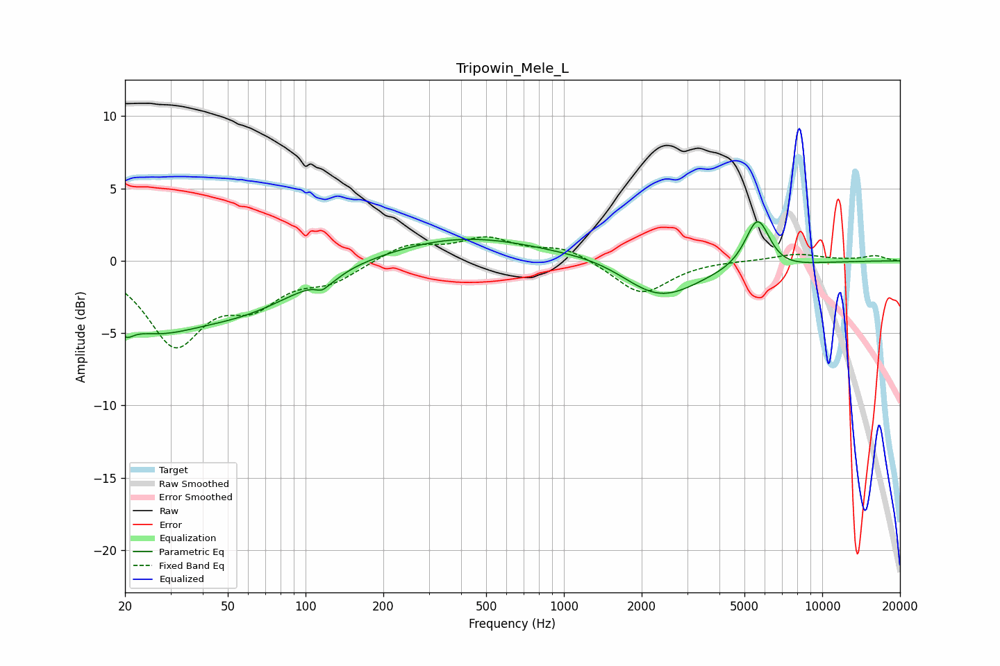

# Tripowin_Mele_L
See [usage instructions](https://github.com/jaakkopasanen/AutoEq#usage) for more options and info.

### Parametric EQs
Apply preamp of -2.8 dB when using parametric equalizer.

|   # | Type    |   Fc (Hz) |    Q |   Gain (dB) |
|-----|---------|-----------|------|-------------|
|   1 | Peaking |        20 | 4.56 |        -1.1 |
|   2 | Peaking |        25 | 0.72 |        -3.8 |
|   3 | Peaking |        59 | 0.62 |        -2.6 |
|   4 | Peaking |       116 | 5.68 |        -0.5 |
|   5 | Peaking |       129 | 3.17 |        -0.3 |
|   6 | Peaking |       407 | 0.48 |         1.7 |
|   7 | Peaking |      1438 | 0.92 |         0.5 |
|   8 | Peaking |      2333 | 0.92 |        -2.7 |
|   9 | Peaking |      5627 | 2.77 |         3.8 |
|  10 | Peaking |      6175 | 1.19 |        -0.7 |

### Fixed Band EQs
When using fixed band (also called graphic) equalizer, apply preamp of **-1.8 dB** (if available) and set gains manually with these parameters.

|   # | Type    |   Fc (Hz) |    Q |   Gain (dB) |
|-----|---------|-----------|------|-------------|
|   1 | Peaking |        31 | 1.41 |        -5.5 |
|   2 | Peaking |        62 | 1.41 |        -2.5 |
|   3 | Peaking |       125 | 1.41 |        -1.2 |
|   4 | Peaking |       250 | 1.41 |         1.2 |
|   5 | Peaking |       500 | 1.41 |         1.4 |
|   6 | Peaking |      1000 | 1.41 |         0.9 |
|   7 | Peaking |      2000 | 1.41 |        -2.4 |
|   8 | Peaking |      4000 | 1.41 |         0   |
|   9 | Peaking |      8000 | 1.41 |         0.5 |
|  10 | Peaking |     16000 | 1.41 |         0.3 |

### Graphs

