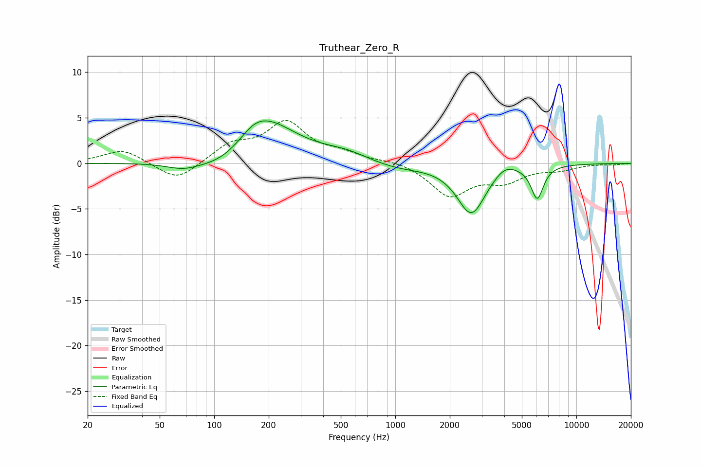

# Truthear_Zero_R
See [usage instructions](https://github.com/jaakkopasanen/AutoEq#usage) for more options and info.

### Parametric EQs
Apply preamp of -4.8 dB when using parametric equalizer.

|   # | Type    |   Fc (Hz) |    Q |   Gain (dB) |
|-----|---------|-----------|------|-------------|
|   1 | Peaking |        67 | 1.56 |        -0.8 |
|   2 | Peaking |       112 | 1.02 |        -1.5 |
|   3 | Peaking |       166 | 2.18 |         0.6 |
|   4 | Peaking |       190 | 0.87 |         4.6 |
|   5 | Peaking |       531 | 0.56 |         0.9 |
|   6 | Peaking |       535 | 1.54 |         0.4 |
|   7 | Peaking |       995 | 0.85 |        -1   |
|   8 | Peaking |      2631 | 1.8  |        -5.5 |
|   9 | Peaking |      4037 | 2.35 |         1   |
|  10 | Peaking |      6079 | 4.05 |        -3.6 |

### Fixed Band EQs
When using fixed band (also called graphic) equalizer, apply preamp of **-4.8 dB** (if available) and set gains manually with these parameters.

|   # | Type    |   Fc (Hz) |    Q |   Gain (dB) |
|-----|---------|-----------|------|-------------|
|   1 | Peaking |        31 | 1.41 |         1.6 |
|   2 | Peaking |        62 | 1.41 |        -2.1 |
|   3 | Peaking |       125 | 1.41 |         1.9 |
|   4 | Peaking |       250 | 1.41 |         4.3 |
|   5 | Peaking |       500 | 1.41 |         0.9 |
|   6 | Peaking |      1000 | 1.41 |         0.3 |
|   7 | Peaking |      2000 | 1.41 |        -3.5 |
|   8 | Peaking |      4000 | 1.41 |        -1.7 |
|   9 | Peaking |      8000 | 1.41 |        -0.6 |
|  10 | Peaking |     16000 | 1.41 |        -0.1 |

### Graphs

