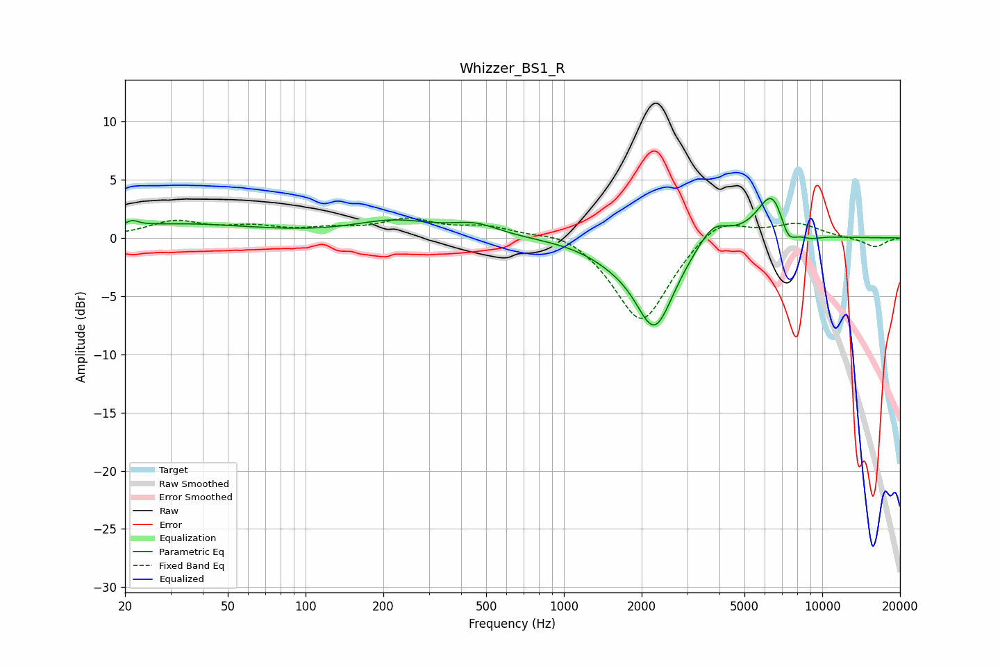

# Whizzer_BS1_R
See [usage instructions](https://github.com/jaakkopasanen/AutoEq#usage) for more options and info.

### Parametric EQs
Apply preamp of -3.5 dB when using parametric equalizer.

|   # | Type    |   Fc (Hz) |    Q |   Gain (dB) |
|-----|---------|-----------|------|-------------|
|   1 | Peaking |        21 | 5.96 |         0.4 |
|   2 | Peaking |        32 | 0.45 |         1.2 |
|   3 | Peaking |       221 | 0.9  |         1.3 |
|   4 | Peaking |       455 | 1.54 |         1   |
|   5 | Peaking |      1531 | 1.33 |        -0.8 |
|   6 | Peaking |      2246 | 1.84 |        -7.5 |
|   7 | Peaking |      3780 | 2.35 |         1.9 |
|   8 | Peaking |      6463 | 2.27 |         4.5 |
|   9 | Peaking |      7337 | 3.8  |        -2.4 |
|  10 | Peaking |      8941 | 2.72 |        -0.5 |

### Fixed Band EQs
When using fixed band (also called graphic) equalizer, apply preamp of **-1.8 dB** (if available) and set gains manually with these parameters.

|   # | Type    |   Fc (Hz) |    Q |   Gain (dB) |
|-----|---------|-----------|------|-------------|
|   1 | Peaking |        31 | 1.41 |         1.3 |
|   2 | Peaking |        62 | 1.41 |         0.8 |
|   3 | Peaking |       125 | 1.41 |         0.6 |
|   4 | Peaking |       250 | 1.41 |         1.4 |
|   5 | Peaking |       500 | 1.41 |         0.9 |
|   6 | Peaking |      1000 | 1.41 |         0.8 |
|   7 | Peaking |      2000 | 1.41 |        -7.5 |
|   8 | Peaking |      4000 | 1.41 |         2   |
|   9 | Peaking |      8000 | 1.41 |         1.2 |
|  10 | Peaking |     16000 | 1.41 |        -0.8 |

### Graphs

