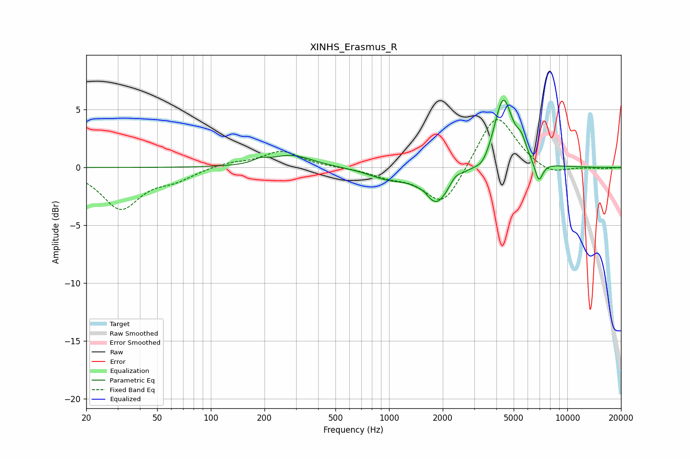

# XINHS_Erasmus_R
See [usage instructions](https://github.com/jaakkopasanen/AutoEq#usage) for more options and info.

### Parametric EQs
Apply preamp of -5.9 dB when using parametric equalizer.

|   # | Type    |   Fc (Hz) |    Q |   Gain (dB) |
|-----|---------|-----------|------|-------------|
|   1 | Peaking |       189 | 3.64 |         0.4 |
|   2 | Peaking |       284 | 1.2  |         1.1 |
|   3 | Peaking |       988 | 1.31 |        -0.8 |
|   4 | Peaking |      1582 | 4.85 |         0.3 |
|   5 | Peaking |      1840 | 1.89 |        -3.1 |
|   6 | Peaking |      2353 | 4.6  |         0.5 |
|   7 | Peaking |      3365 | 3.35 |        -0.8 |
|   8 | Peaking |      4369 | 2.67 |         6.1 |
|   9 | Peaking |      5523 | 5.13 |         1.2 |
|  10 | Peaking |      6917 | 5.99 |        -1.8 |

### Fixed Band EQs
When using fixed band (also called graphic) equalizer, apply preamp of **-4.2 dB** (if available) and set gains manually with these parameters.

|   # | Type    |   Fc (Hz) |    Q |   Gain (dB) |
|-----|---------|-----------|------|-------------|
|   1 | Peaking |        31 | 1.41 |        -3.5 |
|   2 | Peaking |        62 | 1.41 |        -0.9 |
|   3 | Peaking |       125 | 1.41 |         0.4 |
|   4 | Peaking |       250 | 1.41 |         1.4 |
|   5 | Peaking |       500 | 1.41 |         0   |
|   6 | Peaking |      1000 | 1.41 |        -0.6 |
|   7 | Peaking |      2000 | 1.41 |        -3.4 |
|   8 | Peaking |      4000 | 1.41 |         4.9 |
|   9 | Peaking |      8000 | 1.41 |        -0.7 |
|  10 | Peaking |     16000 | 1.41 |        -0.1 |

### Graphs

