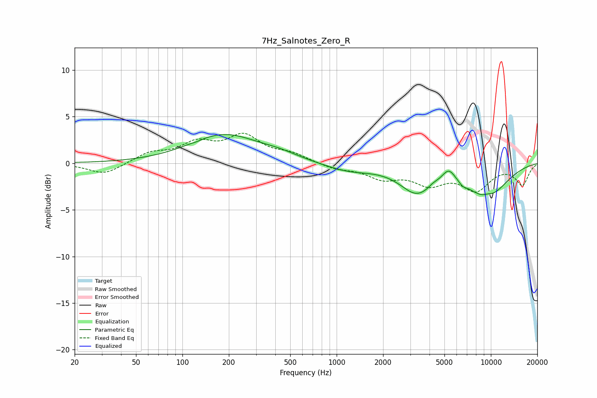

# 7Hz_Salnotes_Zero_R
See [usage instructions](https://github.com/jaakkopasanen/AutoEq#usage) for more options and info.

### Parametric EQs
Apply preamp of -3.2 dB when using parametric equalizer.

|   # | Type    |   Fc (Hz) |    Q |   Gain (dB) |
|-----|---------|-----------|------|-------------|
|   1 | Peaking |       124 | 6    |        -0.1 |
|   2 | Peaking |       186 | 0.63 |         3   |
|   3 | Peaking |       427 | 1.14 |         0.5 |
|   4 | Peaking |      1197 | 0.9  |        -0.8 |
|   5 | Peaking |      3310 | 1.29 |        -2.8 |
|   6 | Peaking |      4215 | 4.62 |         0.3 |
|   7 | Peaking |      5325 | 3.18 |         1.4 |
|   8 | Peaking |      6570 | 6    |        -0.3 |
|   9 | Peaking |      9387 | 0.89 |        -3.4 |
|  10 | Peaking |      9552 | 4.26 |         0.3 |

### Fixed Band EQs
When using fixed band (also called graphic) equalizer, apply preamp of **-3.3 dB** (if available) and set gains manually with these parameters.

|   # | Type    |   Fc (Hz) |    Q |   Gain (dB) |
|-----|---------|-----------|------|-------------|
|   1 | Peaking |        31 | 1.41 |        -1.2 |
|   2 | Peaking |        62 | 1.41 |         1   |
|   3 | Peaking |       125 | 1.41 |         1.9 |
|   4 | Peaking |       250 | 1.41 |         2.7 |
|   5 | Peaking |       500 | 1.41 |         0.9 |
|   6 | Peaking |      1000 | 1.41 |        -0.6 |
|   7 | Peaking |      2000 | 1.41 |        -1.4 |
|   8 | Peaking |      4000 | 1.41 |        -2   |
|   9 | Peaking |      8000 | 1.41 |        -2.7 |
|  10 | Peaking |     16000 | 1.41 |        -2.2 |

### Graphs

