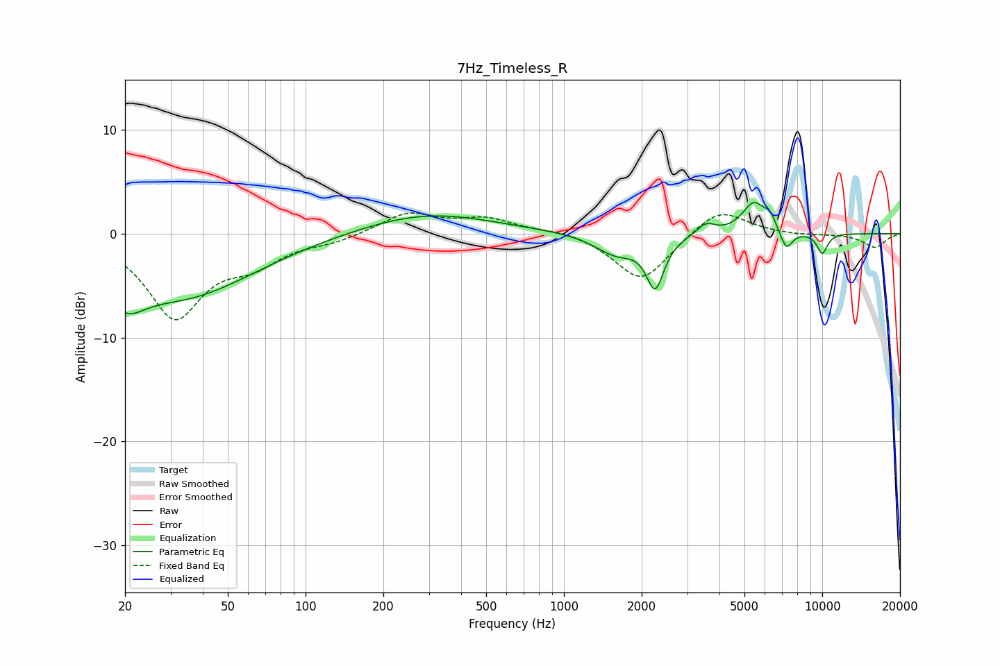

# 7Hz_Timeless_R
See [usage instructions](https://github.com/jaakkopasanen/AutoEq#usage) for more options and info.

### Parametric EQs
Apply preamp of -3.1 dB when using parametric equalizer.

|   # | Type    |   Fc (Hz) |    Q |   Gain (dB) |
|-----|---------|-----------|------|-------------|
|   1 | Peaking |        20 | 1.9  |        -3.1 |
|   2 | Peaking |        33 | 0.5  |        -5.9 |
|   3 | Peaking |       296 | 0.55 |         2   |
|   4 | Peaking |      1594 | 1.67 |        -2   |
|   5 | Peaking |      2256 | 4.18 |        -4.7 |
|   6 | Peaking |      3552 | 4    |         1.1 |
|   7 | Peaking |      5436 | 3.01 |         2.9 |
|   8 | Peaking |      6295 | 6    |         1.1 |
|   9 | Peaking |      7259 | 5.5  |        -1.9 |
|  10 | Peaking |     10000 | 5.87 |        -2   |

### Fixed Band EQs
When using fixed band (also called graphic) equalizer, apply preamp of **-2.1 dB** (if available) and set gains manually with these parameters.

|   # | Type    |   Fc (Hz) |    Q |   Gain (dB) |
|-----|---------|-----------|------|-------------|
|   1 | Peaking |        31 | 1.41 |        -7.9 |
|   2 | Peaking |        62 | 1.41 |        -2.3 |
|   3 | Peaking |       125 | 1.41 |        -0.7 |
|   4 | Peaking |       250 | 1.41 |         2   |
|   5 | Peaking |       500 | 1.41 |         1.3 |
|   6 | Peaking |      1000 | 1.41 |         0.4 |
|   7 | Peaking |      2000 | 1.41 |        -4.7 |
|   8 | Peaking |      4000 | 1.41 |         2.6 |
|   9 | Peaking |      8000 | 1.41 |        -0.2 |
|  10 | Peaking |     16000 | 1.41 |        -1.3 |

### Graphs

