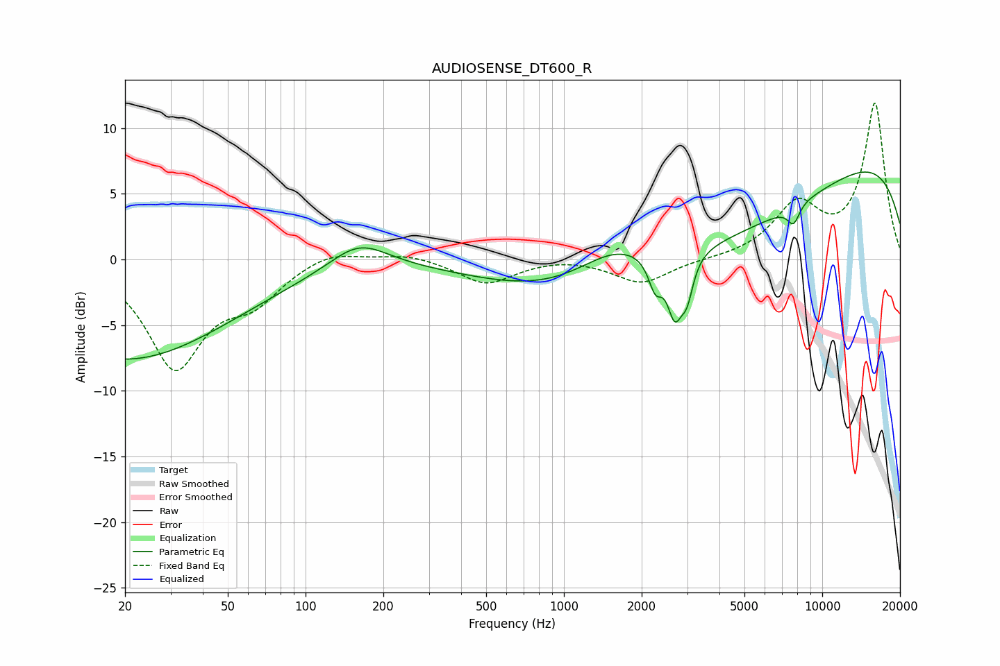

# AUDIOSENSE_DT600_R
See [usage instructions](https://github.com/jaakkopasanen/AutoEq#usage) for more options and info.

### Parametric EQs
Apply preamp of -6.8 dB when using parametric equalizer.

|   # | Type    |   Fc (Hz) |    Q |   Gain (dB) |
|-----|---------|-----------|------|-------------|
|   1 | Peaking |        20 | 0.34 |        -7.6 |
|   2 | Peaking |       161 | 1.25 |         2.1 |
|   3 | Peaking |      1597 | 0.87 |         3.1 |
|   4 | Peaking |      2259 | 5.36 |        -2.3 |
|   5 | Peaking |      2686 | 4.92 |        -4.2 |
|   6 | Peaking |      2996 | 5.93 |        -2.6 |
|   7 | Peaking |      3428 | 0.22 |        -9.1 |
|   8 | Peaking |      7744 | 5.64 |        -1.4 |
|   9 | Peaking |      8329 | 0.18 |        11.5 |
|  10 | Peaking |      8773 | 4.44 |         0   |

### Fixed Band EQs
When using fixed band (also called graphic) equalizer, apply preamp of **-12.0 dB** (if available) and set gains manually with these parameters.

|   # | Type    |   Fc (Hz) |    Q |   Gain (dB) |
|-----|---------|-----------|------|-------------|
|   1 | Peaking |        31 | 1.41 |        -8   |
|   2 | Peaking |        62 | 1.41 |        -2.6 |
|   3 | Peaking |       125 | 1.41 |         0.9 |
|   4 | Peaking |       250 | 1.41 |         0.5 |
|   5 | Peaking |       500 | 1.41 |        -1.8 |
|   6 | Peaking |      1000 | 1.41 |         0.2 |
|   7 | Peaking |      2000 | 1.41 |        -1.8 |
|   8 | Peaking |      4000 | 1.41 |        -0   |
|   9 | Peaking |      8000 | 1.41 |         3.9 |
|  10 | Peaking |     16000 | 1.41 |        11.8 |

### Graphs

