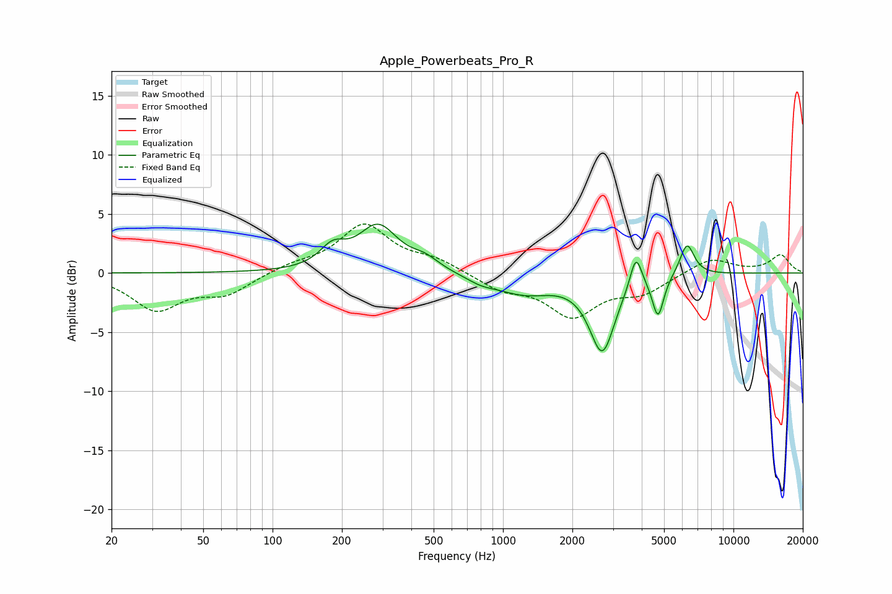

# Apple_Powerbeats_Pro_R
See [usage instructions](https://github.com/jaakkopasanen/AutoEq#usage) for more options and info.

### Parametric EQs
Apply preamp of -4.2 dB when using parametric equalizer.

|   # | Type    |   Fc (Hz) |    Q |   Gain (dB) |
|-----|---------|-----------|------|-------------|
|   1 | Peaking |       182 | 2.54 |         1.6 |
|   2 | Peaking |       287 | 1.66 |         3.8 |
|   3 | Peaking |       458 | 2.33 |         0.9 |
|   4 | Peaking |       804 | 2.17 |        -0.5 |
|   5 | Peaking |      1237 | 1.13 |        -1.6 |
|   6 | Peaking |      2703 | 2.51 |        -6.8 |
|   7 | Peaking |      2961 | 2.18 |         0.4 |
|   8 | Peaking |      3774 | 5.51 |         2.9 |
|   9 | Peaking |      4708 | 5.69 |        -3.5 |
|  10 | Peaking |      6288 | 4.43 |         2.7 |

### Fixed Band EQs
When using fixed band (also called graphic) equalizer, apply preamp of **-4.2 dB** (if available) and set gains manually with these parameters.

|   # | Type    |   Fc (Hz) |    Q |   Gain (dB) |
|-----|---------|-----------|------|-------------|
|   1 | Peaking |        31 | 1.41 |        -3   |
|   2 | Peaking |        62 | 1.41 |        -1.7 |
|   3 | Peaking |       125 | 1.41 |         0.6 |
|   4 | Peaking |       250 | 1.41 |         4   |
|   5 | Peaking |       500 | 1.41 |         1   |
|   6 | Peaking |      1000 | 1.41 |        -1.3 |
|   7 | Peaking |      2000 | 1.41 |        -3.5 |
|   8 | Peaking |      4000 | 1.41 |        -1.5 |
|   9 | Peaking |      8000 | 1.41 |         1.3 |
|  10 | Peaking |     16000 | 1.41 |         1.5 |

### Graphs

