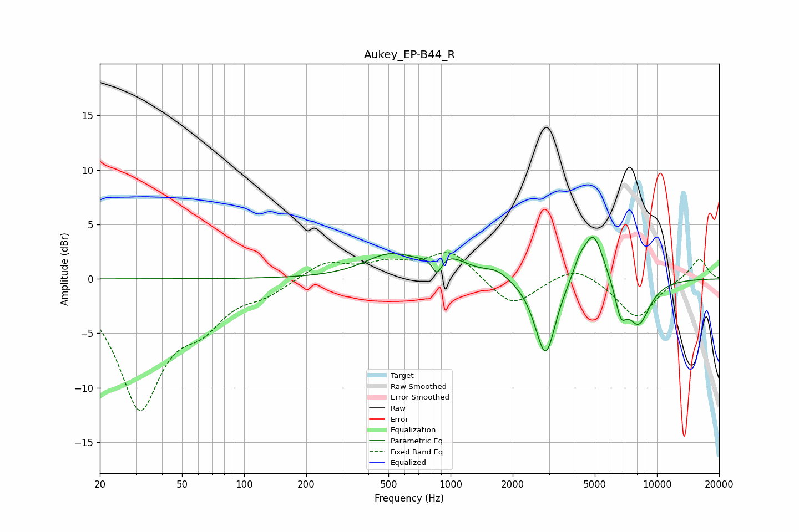

# Aukey_EP-B44_R
See [usage instructions](https://github.com/jaakkopasanen/AutoEq#usage) for more options and info.

### Parametric EQs
Apply preamp of -3.9 dB when using parametric equalizer.

|   # | Type    |   Fc (Hz) |    Q |   Gain (dB) |
|-----|---------|-----------|------|-------------|
|   1 | Peaking |       504 | 1.16 |         2   |
|   2 | Peaking |       860 | 6    |        -1.7 |
|   3 | Peaking |       959 | 1.47 |         1.7 |
|   4 | Peaking |      1675 | 2.4  |         0.7 |
|   5 | Peaking |      2700 | 2.5  |        -0.9 |
|   6 | Peaking |      2899 | 2.97 |        -6.5 |
|   7 | Peaking |      4187 | 4.89 |         1.1 |
|   8 | Peaking |      4915 | 2.69 |         4.8 |
|   9 | Peaking |      6684 | 4.87 |        -2.7 |
|  10 | Peaking |      8138 | 2.27 |        -4.1 |

### Fixed Band EQs
When using fixed band (also called graphic) equalizer, apply preamp of **-2.5 dB** (if available) and set gains manually with these parameters.

|   # | Type    |   Fc (Hz) |    Q |   Gain (dB) |
|-----|---------|-----------|------|-------------|
|   1 | Peaking |        31 | 1.41 |       -11.5 |
|   2 | Peaking |        62 | 1.41 |        -3   |
|   3 | Peaking |       125 | 1.41 |        -1.1 |
|   4 | Peaking |       250 | 1.41 |         1.6 |
|   5 | Peaking |       500 | 1.41 |         1.2 |
|   6 | Peaking |      1000 | 1.41 |         2.6 |
|   7 | Peaking |      2000 | 1.41 |        -2.7 |
|   8 | Peaking |      4000 | 1.41 |         1.4 |
|   9 | Peaking |      8000 | 1.41 |        -3.6 |
|  10 | Peaking |     16000 | 1.41 |         1.9 |

### Graphs

