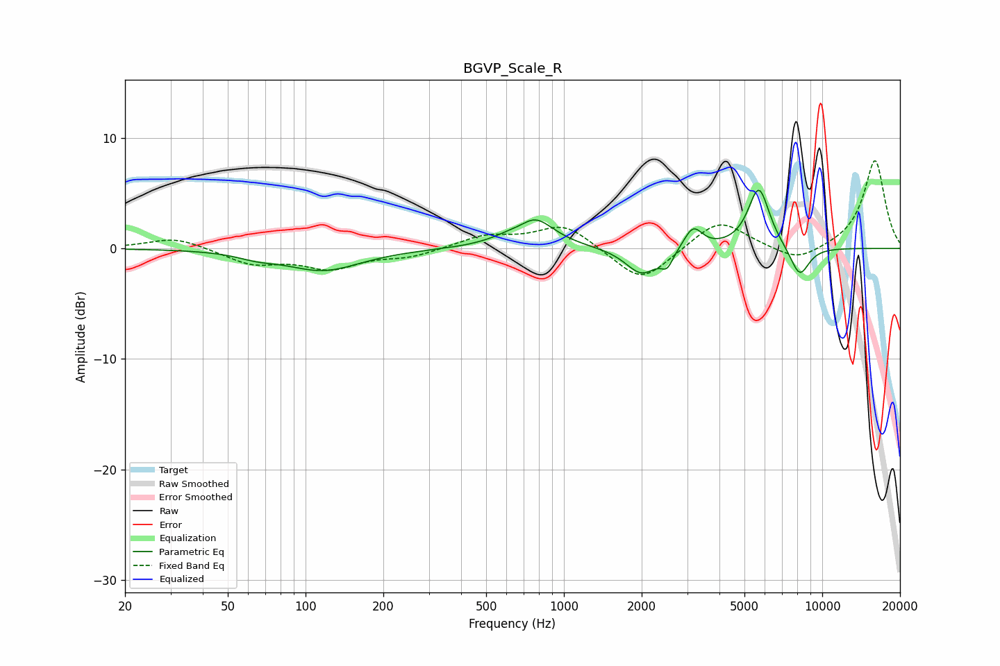

# BGVP_Scale_R
See [usage instructions](https://github.com/jaakkopasanen/AutoEq#usage) for more options and info.

### Parametric EQs
Apply preamp of -5.4 dB when using parametric equalizer.

|   # | Type    |   Fc (Hz) |    Q |   Gain (dB) |
|-----|---------|-----------|------|-------------|
|   1 | Peaking |        65 | 1.92 |        -0.4 |
|   2 | Peaking |       117 | 0.98 |        -2   |
|   3 | Peaking |       674 | 1.56 |         0.5 |
|   4 | Peaking |       691 | 2.87 |        -0.8 |
|   5 | Peaking |       751 | 1.82 |         2.9 |
|   6 | Peaking |      2000 | 2.3  |        -2.4 |
|   7 | Peaking |      2510 | 5.99 |        -1.3 |
|   8 | Peaking |      3163 | 4    |         2   |
|   9 | Peaking |      5682 | 3.3  |         5.5 |
|  10 | Peaking |      8175 | 3.51 |        -2.8 |

### Fixed Band EQs
When using fixed band (also called graphic) equalizer, apply preamp of **-8.0 dB** (if available) and set gains manually with these parameters.

|   # | Type    |   Fc (Hz) |    Q |   Gain (dB) |
|-----|---------|-----------|------|-------------|
|   1 | Peaking |        31 | 1.41 |         1   |
|   2 | Peaking |        62 | 1.41 |        -1.3 |
|   3 | Peaking |       125 | 1.41 |        -1.7 |
|   4 | Peaking |       250 | 1.41 |        -0.7 |
|   5 | Peaking |       500 | 1.41 |         1.1 |
|   6 | Peaking |      1000 | 1.41 |         2.2 |
|   7 | Peaking |      2000 | 1.41 |        -3.2 |
|   8 | Peaking |      4000 | 1.41 |         2.7 |
|   9 | Peaking |      8000 | 1.41 |        -1.3 |
|  10 | Peaking |     16000 | 1.41 |         8   |

### Graphs

