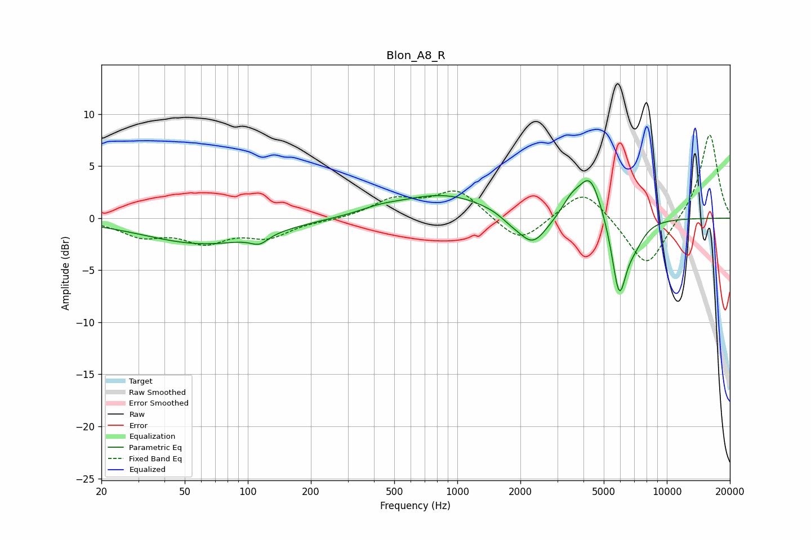

# Blon_A8_R
See [usage instructions](https://github.com/jaakkopasanen/AutoEq#usage) for more options and info.

### Parametric EQs
Apply preamp of -3.7 dB when using parametric equalizer.

|   # | Type    |   Fc (Hz) |    Q |   Gain (dB) |
|-----|---------|-----------|------|-------------|
|   1 | Peaking |        62 | 0.49 |        -2.4 |
|   2 | Peaking |       114 | 3.35 |        -0.9 |
|   3 | Peaking |       426 | 1.53 |         0.4 |
|   4 | Peaking |       859 | 0.64 |         2.3 |
|   5 | Peaking |      1790 | 2.83 |        -0.5 |
|   6 | Peaking |      2285 | 1.99 |        -3   |
|   7 | Peaking |      3505 | 3.1  |         1.3 |
|   8 | Peaking |      4310 | 2.5  |         4.2 |
|   9 | Peaking |      5922 | 3.91 |        -7.2 |
|  10 | Peaking |      7000 | 2.76 |        -1.8 |

### Fixed Band EQs
When using fixed band (also called graphic) equalizer, apply preamp of **-8.1 dB** (if available) and set gains manually with these parameters.

|   # | Type    |   Fc (Hz) |    Q |   Gain (dB) |
|-----|---------|-----------|------|-------------|
|   1 | Peaking |        31 | 1.41 |        -1.5 |
|   2 | Peaking |        62 | 1.41 |        -2   |
|   3 | Peaking |       125 | 1.41 |        -1.6 |
|   4 | Peaking |       250 | 1.41 |        -0.2 |
|   5 | Peaking |       500 | 1.41 |         1.7 |
|   6 | Peaking |      1000 | 1.41 |         2.7 |
|   7 | Peaking |      2000 | 1.41 |        -2.6 |
|   8 | Peaking |      4000 | 1.41 |         3   |
|   9 | Peaking |      8000 | 1.41 |        -4.9 |
|  10 | Peaking |     16000 | 1.41 |         8.3 |

### Graphs

