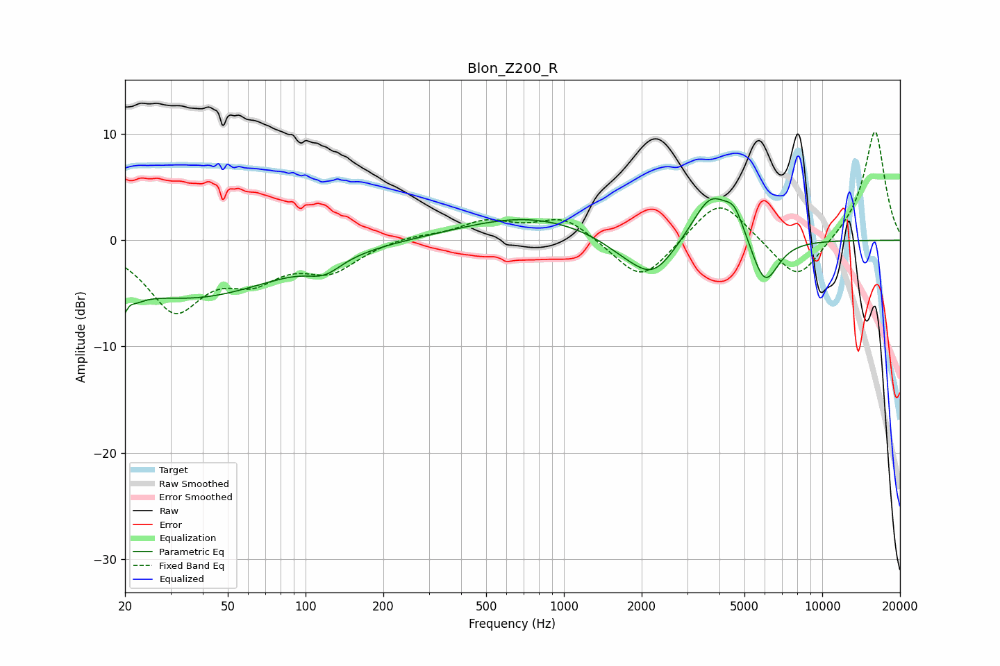

# Blon_Z200_R
See [usage instructions](https://github.com/jaakkopasanen/AutoEq#usage) for more options and info.

### Parametric EQs
Apply preamp of -4.0 dB when using parametric equalizer.

|   # | Type    |   Fc (Hz) |    Q |   Gain (dB) |
|-----|---------|-----------|------|-------------|
|   1 | Peaking |        20 | 4.25 |        -5.7 |
|   2 | Peaking |        21 | 5.93 |         3.3 |
|   3 | Peaking |        36 | 0.41 |        -5.3 |
|   4 | Peaking |       118 | 2.18 |        -1.3 |
|   5 | Peaking |       723 | 0.55 |         2.3 |
|   6 | Peaking |      1698 | 1.44 |        -1   |
|   7 | Peaking |      2216 | 1.61 |        -3.5 |
|   8 | Peaking |      3704 | 1.93 |         4.5 |
|   9 | Peaking |      4583 | 3.64 |         2.2 |
|  10 | Peaking |      5999 | 2.63 |        -4.5 |

### Fixed Band EQs
When using fixed band (also called graphic) equalizer, apply preamp of **-10.3 dB** (if available) and set gains manually with these parameters.

|   # | Type    |   Fc (Hz) |    Q |   Gain (dB) |
|-----|---------|-----------|------|-------------|
|   1 | Peaking |        31 | 1.41 |        -6.3 |
|   2 | Peaking |        62 | 1.41 |        -2.9 |
|   3 | Peaking |       125 | 1.41 |        -2.6 |
|   4 | Peaking |       250 | 1.41 |         0.5 |
|   5 | Peaking |       500 | 1.41 |         1.7 |
|   6 | Peaking |      1000 | 1.41 |         2.2 |
|   7 | Peaking |      2000 | 1.41 |        -4.1 |
|   8 | Peaking |      4000 | 1.41 |         4.1 |
|   9 | Peaking |      8000 | 1.41 |        -4.1 |
|  10 | Peaking |     16000 | 1.41 |        10.4 |

### Graphs

