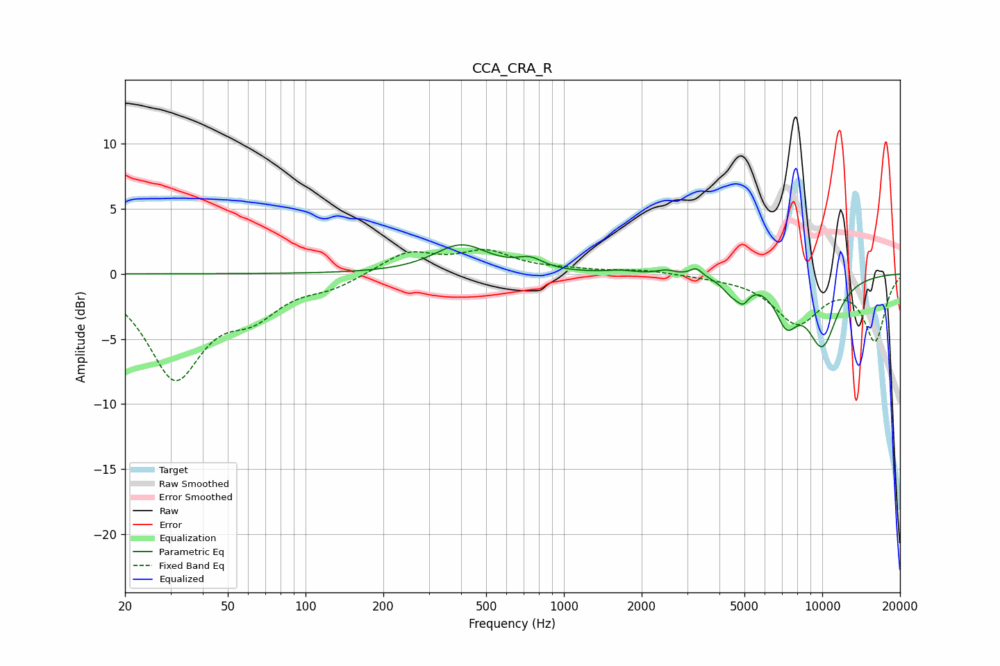

# CCA_CRA_R
See [usage instructions](https://github.com/jaakkopasanen/AutoEq#usage) for more options and info.

### Parametric EQs
Apply preamp of -2.3 dB when using parametric equalizer.

|   # | Type    |   Fc (Hz) |    Q |   Gain (dB) |
|-----|---------|-----------|------|-------------|
|   1 | Peaking |       400 | 1.35 |         2.2 |
|   2 | Peaking |       739 | 2.8  |         0.8 |
|   3 | Peaking |      1410 | 1.7  |         0   |
|   4 | Peaking |      1654 | 2.87 |         0.2 |
|   5 | Peaking |      2488 | 4.04 |         0.3 |
|   6 | Peaking |      3251 | 5.99 |         0.6 |
|   7 | Peaking |      4477 | 3.94 |        -1   |
|   8 | Peaking |      4947 | 5.96 |        -1.1 |
|   9 | Peaking |      7272 | 3.14 |        -2.9 |
|  10 | Peaking |     10000 | 2.02 |        -5.2 |

### Fixed Band EQs
When using fixed band (also called graphic) equalizer, apply preamp of **-2.0 dB** (if available) and set gains manually with these parameters.

|   # | Type    |   Fc (Hz) |    Q |   Gain (dB) |
|-----|---------|-----------|------|-------------|
|   1 | Peaking |        31 | 1.41 |        -7.7 |
|   2 | Peaking |        62 | 1.41 |        -2.5 |
|   3 | Peaking |       125 | 1.41 |        -0.9 |
|   4 | Peaking |       250 | 1.41 |         1.7 |
|   5 | Peaking |       500 | 1.41 |         1.6 |
|   6 | Peaking |      1000 | 1.41 |         0.2 |
|   7 | Peaking |      2000 | 1.41 |         0.3 |
|   8 | Peaking |      4000 | 1.41 |        -0.1 |
|   9 | Peaking |      8000 | 1.41 |        -3.6 |
|  10 | Peaking |     16000 | 1.41 |        -5   |

### Graphs

