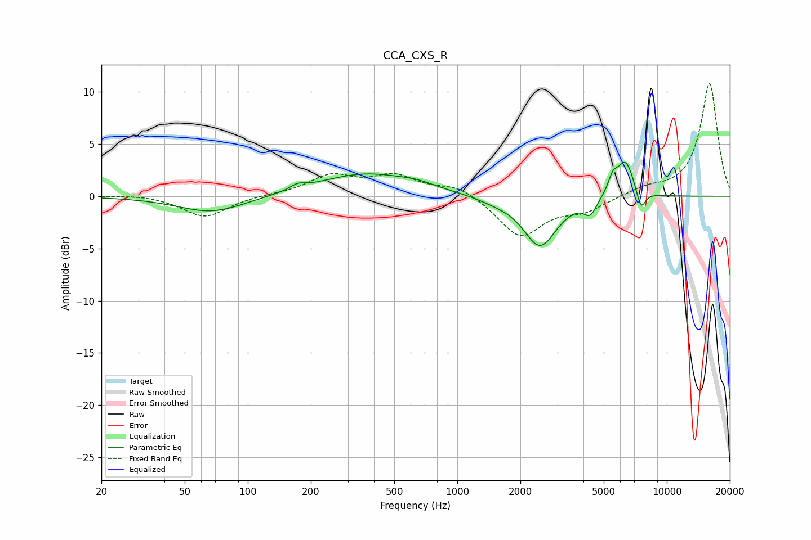

# CCA_CXS_R
See [usage instructions](https://github.com/jaakkopasanen/AutoEq#usage) for more options and info.

### Parametric EQs
Apply preamp of -3.3 dB when using parametric equalizer.

|   # | Type    |   Fc (Hz) |    Q |   Gain (dB) |
|-----|---------|-----------|------|-------------|
|   1 | Peaking |        67 | 0.88 |        -1.6 |
|   2 | Peaking |       173 | 4.01 |         0.5 |
|   3 | Peaking |       368 | 0.6  |         2.2 |
|   4 | Peaking |       645 | 1.92 |         0.3 |
|   5 | Peaking |      1503 | 1.64 |        -0.4 |
|   6 | Peaking |      2481 | 1.79 |        -4.8 |
|   7 | Peaking |      4310 | 4.59 |        -1.4 |
|   8 | Peaking |      5527 | 5.99 |         1.4 |
|   9 | Peaking |      6357 | 3.3  |         3.5 |
|  10 | Peaking |      7522 | 6    |        -2   |

### Fixed Band EQs
When using fixed band (also called graphic) equalizer, apply preamp of **-10.9 dB** (if available) and set gains manually with these parameters.

|   # | Type    |   Fc (Hz) |    Q |   Gain (dB) |
|-----|---------|-----------|------|-------------|
|   1 | Peaking |        31 | 1.41 |         0.2 |
|   2 | Peaking |        62 | 1.41 |        -2   |
|   3 | Peaking |       125 | 1.41 |         0.1 |
|   4 | Peaking |       250 | 1.41 |         1.9 |
|   5 | Peaking |       500 | 1.41 |         1.8 |
|   6 | Peaking |      1000 | 1.41 |         1   |
|   7 | Peaking |      2000 | 1.41 |        -3.8 |
|   8 | Peaking |      4000 | 1.41 |        -1.3 |
|   9 | Peaking |      8000 | 1.41 |         0.7 |
|  10 | Peaking |     16000 | 1.41 |        10.8 |

### Graphs

