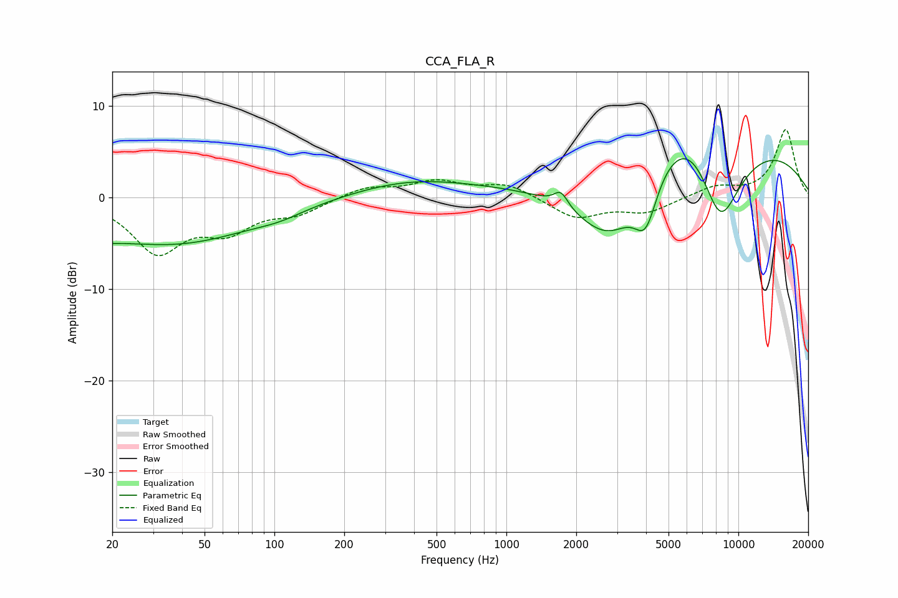

# CCA_FLA_R
See [usage instructions](https://github.com/jaakkopasanen/AutoEq#usage) for more options and info.

### Parametric EQs
Apply preamp of -4.3 dB when using parametric equalizer.

|   # | Type    |   Fc (Hz) |    Q |   Gain (dB) |
|-----|---------|-----------|------|-------------|
|   1 | Peaking |        20 | 2.64 |        -3.8 |
|   2 | Peaking |        21 | 2.84 |         3   |
|   3 | Peaking |        36 | 0.39 |        -5   |
|   4 | Peaking |       105 | 1.39 |        -0.6 |
|   5 | Peaking |       386 | 0.54 |         1.8 |
|   6 | Peaking |      1718 | 4.67 |         1.6 |
|   7 | Peaking |      2789 | 0.72 |       -12.1 |
|   8 | Peaking |      3989 | 2.8  |        -5.3 |
|   9 | Peaking |      6320 | 0.38 |        19.1 |
|  10 | Peaking |      8312 | 0.99 |       -15.9 |

### Fixed Band EQs
When using fixed band (also called graphic) equalizer, apply preamp of **-7.5 dB** (if available) and set gains manually with these parameters.

|   # | Type    |   Fc (Hz) |    Q |   Gain (dB) |
|-----|---------|-----------|------|-------------|
|   1 | Peaking |        31 | 1.41 |        -5.7 |
|   2 | Peaking |        62 | 1.41 |        -3.1 |
|   3 | Peaking |       125 | 1.41 |        -1.5 |
|   4 | Peaking |       250 | 1.41 |         1.2 |
|   5 | Peaking |       500 | 1.41 |         1.7 |
|   6 | Peaking |      1000 | 1.41 |         1.5 |
|   7 | Peaking |      2000 | 1.41 |        -2.2 |
|   8 | Peaking |      4000 | 1.41 |        -1.5 |
|   9 | Peaking |      8000 | 1.41 |         1.2 |
|  10 | Peaking |     16000 | 1.41 |         7.4 |

### Graphs

