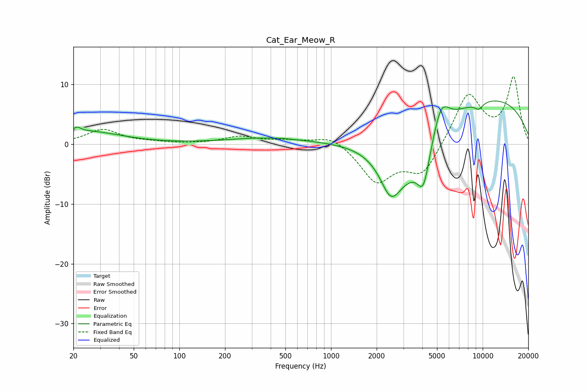

# Cat_Ear_Meow_R
See [usage instructions](https://github.com/jaakkopasanen/AutoEq#usage) for more options and info.

### Parametric EQs
Apply preamp of -7.3 dB when using parametric equalizer.

|   # | Type    |   Fc (Hz) |    Q |   Gain (dB) |
|-----|---------|-----------|------|-------------|
|   1 | Peaking |        21 | 5.86 |         0.8 |
|   2 | Peaking |        24 | 0.62 |         2.1 |
|   3 | Peaking |       369 | 0.55 |         1   |
|   4 | Peaking |       477 | 3.97 |         0   |
|   5 | Peaking |      2478 | 2.1  |        -5.9 |
|   6 | Peaking |      3287 | 0.69 |        -9.8 |
|   7 | Peaking |      4073 | 3.45 |        -6.2 |
|   8 | Peaking |      5317 | 2.49 |         5.3 |
|   9 | Peaking |      8265 | 0.22 |         8.9 |
|  10 | Peaking |      9432 | 4.36 |        -1.1 |

### Fixed Band EQs
When using fixed band (also called graphic) equalizer, apply preamp of **-11.4 dB** (if available) and set gains manually with these parameters.

|   # | Type    |   Fc (Hz) |    Q |   Gain (dB) |
|-----|---------|-----------|------|-------------|
|   1 | Peaking |        31 | 1.41 |         2.4 |
|   2 | Peaking |        62 | 1.41 |         0.3 |
|   3 | Peaking |       125 | 1.41 |         0   |
|   4 | Peaking |       250 | 1.41 |         1.2 |
|   5 | Peaking |       500 | 1.41 |         0.5 |
|   6 | Peaking |      1000 | 1.41 |         1.7 |
|   7 | Peaking |      2000 | 1.41 |        -6.2 |
|   8 | Peaking |      4000 | 1.41 |        -5.1 |
|   9 | Peaking |      8000 | 1.41 |         8.5 |
|  10 | Peaking |     16000 | 1.41 |        11   |

### Graphs

