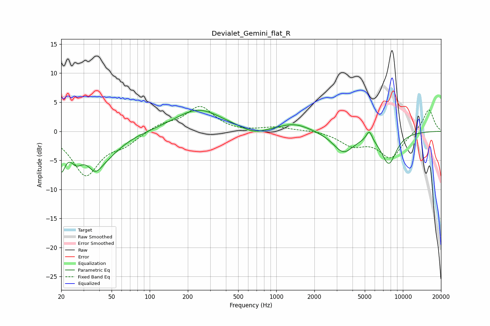

# Devialet_Gemini_flat_R
See [usage instructions](https://github.com/jaakkopasanen/AutoEq#usage) for more options and info.

### Parametric EQs
Apply preamp of -3.7 dB when using parametric equalizer.

|   # | Type    |   Fc (Hz) |    Q |   Gain (dB) |
|-----|---------|-----------|------|-------------|
|   1 | Peaking |        20 | 4.59 |        -5   |
|   2 | Peaking |        26 | 3.1  |        -2.6 |
|   3 | Peaking |        37 | 2.91 |        -2.1 |
|   4 | Peaking |        41 | 1.01 |        -4.5 |
|   5 | Peaking |       242 | 0.77 |         3.8 |
|   6 | Peaking |       666 | 1.45 |        -1.1 |
|   7 | Peaking |      1393 | 1.15 |         1.4 |
|   8 | Peaking |      3392 | 1.69 |        -3.5 |
|   9 | Peaking |      5423 | 5.85 |         1.9 |
|  10 | Peaking |      7736 | 2.2  |        -5.4 |

### Fixed Band EQs
When using fixed band (also called graphic) equalizer, apply preamp of **-4.4 dB** (if available) and set gains manually with these parameters.

|   # | Type    |   Fc (Hz) |    Q |   Gain (dB) |
|-----|---------|-----------|------|-------------|
|   1 | Peaking |        31 | 1.41 |        -7.4 |
|   2 | Peaking |        62 | 1.41 |        -1.9 |
|   3 | Peaking |       125 | 1.41 |         1.2 |
|   4 | Peaking |       250 | 1.41 |         4.2 |
|   5 | Peaking |       500 | 1.41 |        -0.2 |
|   6 | Peaking |      1000 | 1.41 |         0.7 |
|   7 | Peaking |      2000 | 1.41 |         0.2 |
|   8 | Peaking |      4000 | 1.41 |        -2.2 |
|   9 | Peaking |      8000 | 1.41 |        -4.5 |
|  10 | Peaking |     16000 | 1.41 |         3.9 |

### Graphs

