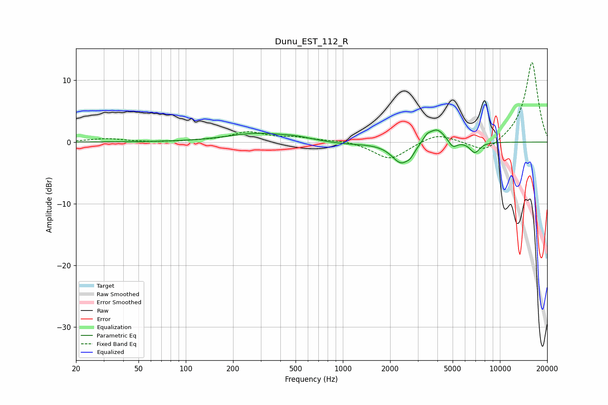

# Dunu_EST_112_R
See [usage instructions](https://github.com/jaakkopasanen/AutoEq#usage) for more options and info.

### Parametric EQs
Apply preamp of -2.0 dB when using parametric equalizer.

|   # | Type    |   Fc (Hz) |    Q |   Gain (dB) |
|-----|---------|-----------|------|-------------|
|   1 | Peaking |       283 | 0.76 |         1.4 |
|   2 | Peaking |       489 | 1.74 |         0.3 |
|   3 | Peaking |       624 | 1.43 |         0.1 |
|   4 | Peaking |      1006 | 0.9  |        -0.4 |
|   5 | Peaking |      2353 | 2.36 |        -3.4 |
|   6 | Peaking |      2697 | 6    |        -0.7 |
|   7 | Peaking |      3423 | 6    |         0.8 |
|   8 | Peaking |      3963 | 2.67 |         2.4 |
|   9 | Peaking |      5014 | 5.27 |        -1.2 |
|  10 | Peaking |      6923 | 4.29 |        -1.7 |

### Fixed Band EQs
When using fixed band (also called graphic) equalizer, apply preamp of **-13.0 dB** (if available) and set gains manually with these parameters.

|   # | Type    |   Fc (Hz) |    Q |   Gain (dB) |
|-----|---------|-----------|------|-------------|
|   1 | Peaking |        31 | 1.41 |         0.5 |
|   2 | Peaking |        62 | 1.41 |        -0.1 |
|   3 | Peaking |       125 | 1.41 |         0.2 |
|   4 | Peaking |       250 | 1.41 |         1.5 |
|   5 | Peaking |       500 | 1.41 |         0.6 |
|   6 | Peaking |      1000 | 1.41 |         0.3 |
|   7 | Peaking |      2000 | 1.41 |        -2.9 |
|   8 | Peaking |      4000 | 1.41 |         1.5 |
|   9 | Peaking |      8000 | 1.41 |        -2   |
|  10 | Peaking |     16000 | 1.41 |        13.1 |

### Graphs

