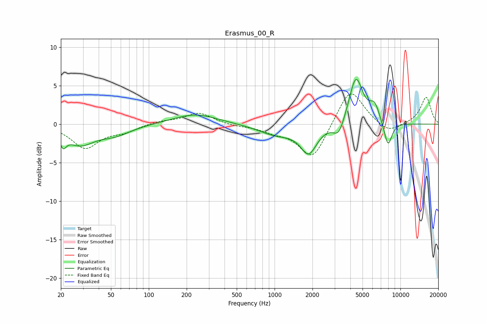

# Erasmus_00_R
See [usage instructions](https://github.com/jaakkopasanen/AutoEq#usage) for more options and info.

### Parametric EQs
Apply preamp of -5.9 dB when using parametric equalizer.

|   # | Type    |   Fc (Hz) |    Q |   Gain (dB) |
|-----|---------|-----------|------|-------------|
|   1 | Peaking |        21 | 5.71 |        -1.5 |
|   2 | Peaking |        28 | 1.24 |        -2.4 |
|   3 | Peaking |        54 | 1.1  |        -1.2 |
|   4 | Peaking |       234 | 0.81 |         1.3 |
|   5 | Peaking |      1028 | 1    |        -1.3 |
|   6 | Peaking |      1865 | 2.18 |        -3.5 |
|   7 | Peaking |      3239 | 3.2  |        -2   |
|   8 | Peaking |      4425 | 2.52 |         6.2 |
|   9 | Peaking |      6230 | 3.39 |         2.1 |
|  10 | Peaking |      7963 | 4.13 |        -3.3 |

### Fixed Band EQs
When using fixed band (also called graphic) equalizer, apply preamp of **-4.0 dB** (if available) and set gains manually with these parameters.

|   # | Type    |   Fc (Hz) |    Q |   Gain (dB) |
|-----|---------|-----------|------|-------------|
|   1 | Peaking |        31 | 1.41 |        -3   |
|   2 | Peaking |        62 | 1.41 |        -0.8 |
|   3 | Peaking |       125 | 1.41 |         0.4 |
|   4 | Peaking |       250 | 1.41 |         1.5 |
|   5 | Peaking |       500 | 1.41 |        -0.2 |
|   6 | Peaking |      1000 | 1.41 |        -0.8 |
|   7 | Peaking |      2000 | 1.41 |        -4.7 |
|   8 | Peaking |      4000 | 1.41 |         4.9 |
|   9 | Peaking |      8000 | 1.41 |        -1.3 |
|  10 | Peaking |     16000 | 1.41 |         3.5 |

### Graphs

